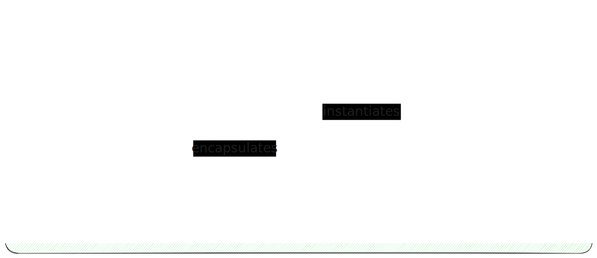

# 2 Domain-driven design: Implementation in code

*17-7-2023 - updated 8-8-2023*

Status: Work in progress

## Architectural layers

In Domain-driven design there are five layers (in general). In my implementation there are four, because I integrated
the integration layer with the persistence layer.

The layers in the application are isolated from each other.

Domain layer: Contains the domain model and its business logic.
Application layer: Contains the services, this is an orchestrator.
Infrastructure layer: Contains persistence model and persistence logic (in my case) and can have integration (maybe in
the future for the demo webshop)
Presentation layer: Contains the API endpoints (in my case) and has security-related logic.

### Domain layer

The Domain layer is where the Domain model lives. It contains the business logic.

#### Domain layer in theory

In developing my domain layer I used the following principles.

- Persistence ignorance principle
- Infrastructure ignorance principle
- No dependencies
- Contains business rules

As I read some books, many websites and studied a lot
of [repositories](https://blog.jacobsdata.com/2020/03/02/a-clean-domain-driven-design-architectural-template), the
following picture reflects the theory of how the domain model should be developed.

The aggregate encapsulates the entities and the value objects. The aggregate is accessed through a repository and
instantiated with a factory.

The Aggregate is discussed
in [Tactical Design](/blog/domaindrivendesignwebshop/1domaindrivendesignwebshop.html#step-2-tactical-design), my first
blog entry about domain driven design. The aggregate forms a transactional boundary.

The domain model is instantiated through the [factory pattern](https://refactoring.guru/design-patterns/factory-method).
During creation you (may) have business rules to be kicked off while creating a new object, so this makes sense.

For accessing the repository pattern is suggested in the original book by Eric Evans, for object management and
persistence. Which I guess is okay if we are talking mid- and end of lifecycle of the object. However this is clashing
with the persistence ignorance. What to do?

Back to the design goal. I want the business logic to be kicked off on an accessible object. So I need an access
mechanism. However, I want it to be persistence ignorant, because in my opinion, isolation is important. I want to
isolate the domain layer from persistence, so I can keep the domain model as pure as possible. I can call it a
repository pattern, but won't that be confusing? How will this work in practice?

#### Domain layer in practice

A key principle in software (design and development): Keep it simple.
So why using all these obfuscating patterns? Why not keeping it a bit simpler?

What do I actually want?

- Clear structure reflecting Domain Driven Design
- Aggregate to encapsulate the entities and value objects
- Interface for loose coupling

What do I need?

- Initialization.
- Access

NB!! Note-to-self: I think I should return an aggregate here? And not exposing the entity? How to do this???

NB This is based on graph theory (object oriented programming)

### Presentation layer

The Presentation layer is for the users. So it should only expose user-relevant stuff.
It should contain logic and validation using
the [Chain of responsibility pattern](https://refactoring.guru/design-patterns/chain-of-responsibility), also known as
pipe and filter. This can contain basic validation (is the date entered as the correct type, are there required values
which are empty).

The Controllers no longer are following the controller (mediator) pattern, but are just one-on-one sending to the
application layer, which acts as a mediator.

### Application layer

The Application layer connects the different layers with each other. It is an orchestration layer, so this contains task
coordination logic.
Should be thin.
Preferable stateless. If it has state, this state is reflecting the progress of task coordination.

Use Service-Interface and DTO as a [Mediator pattern](https://refactoring.guru/design-patterns/mediator) to expose as an
interface to the Presentation layer.
Use [adapter patter](https://refactoring.guru/design-patterns/adapter) to be able to use the Domain and Data Access
interfaces.

### Infrastructure layer

The Infrastructure layer is for persistence of data and integration to other services.

#### Persistence layer

Data access.

https://learn.microsoft.com/en-us/dotnet/architecture/microservices/microservice-ddd-cqrs-patterns/infrastructure-persistence-layer-design

#### Integration layer

Plumbing, like logging, messaging, SOAP, REST, File Access

## Resources

[Software alchemy - A Template for Clean Domain-Driven Design Architecture](https://blog.jacobsdata.com/2020/03/02/a-clean-domain-driven-design-architectural-template)  
[Code Opinion](https://codeopinion.com/)  
Julie Lerman - The intersection of Microservices, domain-driven design and entity framework core  
Milan Jovanovic

