# Image resize in dotNet: from JPG to Webp on Windows OS

*2-4-2026*

## Introduction

This test is a follow-up for the [Image resize in dotNet -JPG to JPG](./image-resize-in-dotnet-2026.md), and answers these follow-up questions:

- Which packages support JPEG (.jpg), WEBP (.webp) and Portable Network Graphics (.png)?
- How do these packages perform?
- Are there differences in quality between the packages?

I used about the same packages from the image resize test.

## Boundary conditions

This test:

- uses 12 pictures of 500kB size each, ~1280 x ~900 px by [Bertrand Le Roy](https://devblogs.microsoft.com/dotnet/net-core-image-processing/) plus 3 images of my own ~4000 x ~3000 px and 2-3MB.
- resizes to thumbnail size (~80px), small (320px) and medium (768px) sizes
- benchmarks the loading, resizing and saving operations with Benchmark.NET
- uses .NET 10 (LTS)
- uses Windows 11 only
- wants to achieve the highest image quality.
- saves the original jpeg as 95% quality jpeg format, png and webp in different sizes

### Packages summarized

A summary of the packages used in this table:

| Package                                                                  |                                                                               License | Published | Version | Downloads |
|--------------------------------------------------------------------------|--------------------------------------------------------------------------------------:|----------:|--------:|----------:|
| [System.Drawing](https://www.nuget.org/packages/System.Drawing.Common)   |                                MIT |    3-2025 |  10.0.5 |  2500.0 M |
| [Magick.Net](https://www.nuget.org/packages/Magick.NET.Core)             |                                                                            Apache 2.0 |    3-2026 | 14.11.1 |    47.1 M |
| [MagicScaler](https://www.nuget.org/packages/PhotoSauce.MagicScaler)     |                                                                                   MIT |   12-2024 |  0.15.0 |     2.0 M |
| [ImageSharp](https://www.nuget.org/packages/SixLabors.ImageSharp)        | [Six Labors split](https://www.nuget.org/packages/SixLabors.ImageSharp/3.1.1/license) |   12-2025 |  3.1.12 |   234.7 M |
| [NetVips](https://www.nuget.org/packages/NetVips)                        |                                                                                   MIT |    1-2026 |   3.2.0 |     2.4 M |
| [SkiaSharp](https://www.nuget.org/packages/SkiaSharp)                    |                                                                                   MIT |    1-2026 | 3.119.2 |     249 M |

Read about the resize and implementation details in the [Image resize in dotNet -JPG to JPG](./image-resize-in-dotnet-2026.md).  
I did not use the imageFlow, because I had trouble with the memory use in the previous implementation already. It is possible to use this package for webp as well, it has encoders.

### Format support

The packages claim to support lots of formats. And in fact have no support whatsoever. I only checked for Webp, PNG and
Jpg.

| Package                                                                | JPG | PNG | Webp |                                    Remarks |
|------------------------------------------------------------------------|-----|-----|------|-------------------------------------------:|
| [System.Drawing](https://www.nuget.org/packages/System.Drawing.Common) | y   | y   | *    | depends on GDI+ codecs installed and found |
| [ImageSharp](https://github.com/SixLabors/ImageSharp)                  | y   | y   | y    |                   GIF and ~3 other formats |
| [Magick.Net](https://github.com/dlemstra/Magick.NET)                   | y   | y   | y    |                 GIF and ~100 other formats |
| [MagicScaler](https://www.nuget.org/packages/PhotoSauce.MagicScaler)   | y   | y   | y    |            depends on WIC codecs installed |
| [NetVips](https://www.nuget.org/packages/NetVips)                     | y   | y   | y    |             GIF and multiple other formats |
| [SkiaSharp](https://github.com/mono/SkiaSharp)                         | y   | y   | y    |     none of the 9 other supported formats? |      
| [ImageFlow](https://github.com/imazen/imageflow-dotnet)                | y   | y   | y    |                 no other formats supported |     

For System.Drawing.Common, Webp has support on windows GDI+ since windows 10- 1089. However, it depends on the codec
installed on your system. If no codec can be found, System.Drawing will silently fall back to PNG. I could not get it to work (in the limited time available).

In this test the silent fallback was observed. In order to have a WebP format in test, System.Drawing uses the SkiaSharp package for encoding and saving the image as WebP.

According to a [Xamarin blog by Microsoft](https://learn.microsoft.com/en-us/xamarin/xamarin-forms/user-interface/graphics/skiasharp/bitmaps/saving#exploring-the-image-formats), SkiaSharp only supports three of the 12 image formats. This test does not check that claim.

## Results in numbers

The results of this test in numbers: the time elapsed to produce the pictures, the memory used and the resulting
filesize.

### Time elapsed

The time elapsed is just an indication, as run on my laptop. So please just focus on the ratio.

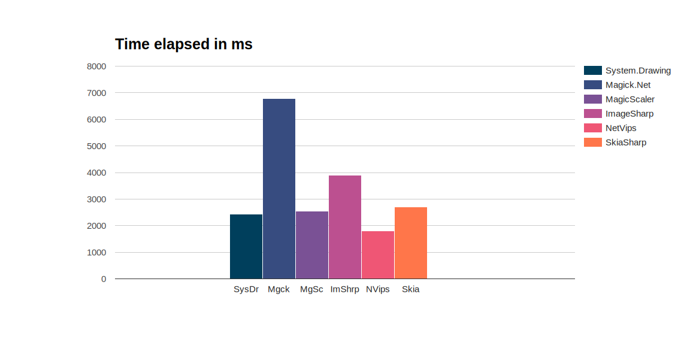

This is not optimized at this moment. For Magick.Net three separate processes are spun up to handle the images. I can
imagine this takes time (and memory), making it three times slower.
I just spent max 15 minutes per package to do this stuff, I had no more time to spare. Please let me know if you want to
improve, or have ideas.

#### Conclusion

Measuring decreases the performance of the code. All of these packages are fast enough, with Magick.NET being twice
slower than the other packages.

### Memory usage

The next picture shows allocated memory usage. For your machine this does not matter, as generally speaking the amount
of memory on your own machine is sufficient. If you have functions or other an app in the cloud where you pay for
memory (or simply crash on memory overload), this is very relevant.

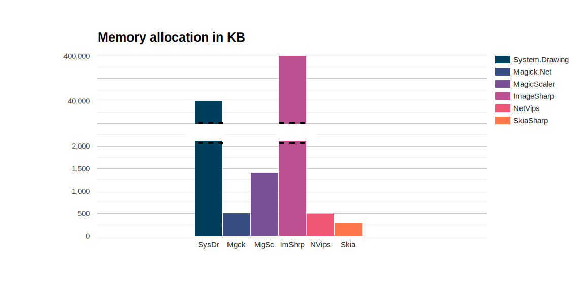

For the record: I screwed up System.Drawing by the way I use Skia to save the WebP files. Memory usage of System.Drawing without Skia/WebP is in the order of 500kB. The usage of Skia is about 500kB, so there is nno reason why those combined should be that high.
ImageSharp uses a lot of memory. Same as for the image resize blog, I just cut corners, and used the FileHelper shortcut. There are so many options within this package to improve, and I should. If only I could find the right way...

#### Conclusion

For the largest part memory usage is caused by my mistakes, but it shows that these packages are very sensitive to small changes causing them to misbehave drastically. If you want to use these packages, you need to understand them and their settings

### File size

Here the filesize of some 320px-images is shown. It is more about the ratio than the absolute numbers. Keep in mind that this is foremost a reflection of the settings and encoders used.

In general, WebP has the smallest size, closely followed by jpg. The png files are the largest, but there are differences in produced file size between the packages.

- ImageSharp produces very small WebP files. I cannot explain why, in the next paragraph see if this has effect on the quality. 
- MagicScalar produces very small PNG files, because they lower the bit depth to 24, where other packages are on 32. Keep this in mind when looking at the picture quality later. This might be a configuration that can be changed?
- System.Drawing and NetVips produce large PNG-files for no apparent reason.

Another way to look at this is: What configuration needs to change in order to produce comparable results?

## Quality

Quality is again a subjective matter. Let's look to some of the pictures produced and see the differences.

### ColorSpace management

Most applications use sRGB colorSpace to show a jpg picture. However, there is not such a thing as a default colorSpace. There are several color profiles in-use, and if the developer does not use the right settings to handle this, the picture will look terrible.
I changed the settings for most of the libraries to do a conversion to sRGB.
This conversion step will slow the process down, but I'd rather have a slow process than faulty colors.

The picture of Wild River has an Adobe RGB profile, which has to be converted to sRGB. Because of the blue, it will show if I have the settings wrong.

This is the original picture, notice the blue.

The blue in the pictures below should be unchanged (same shade of blue) in the ideal case.

| Package        | JPG                                                                                                                               | PNG                                                                                                                           | Webp                                                                                                                              |
|----------------|-----------------------------------------------------------------------------------------------------------------------------------|-------------------------------------------------------------------------------------------------------------------------------|-----------------------------------------------------------------------------------------------------------------------------------|
| System.Drawing |  |  |  |
| ImageSharp     |             |             |                |
| Magick.Net     |                |                |                   |
| MagicScaler    |          |          |             |
| NetVips        |                  |                |                   |
| SkiaSharp      |                |                |                   |

I did not change any settings for this test, so any color mangling comes out of the box. Or because of other reasons?  
- System.Drawing handles colorspace management for blue just fine.  
- ImageSharp has the right blue.  
- Magick.NET handles colorspace management fine, since I fixed the color mangling by keeping the icc-profile in the image.
- MagicScaler has the right blue, but seems to be a bit brighter or sharper.  
- NetVips has the right blue, look at the code to make sure it keeps the icc-profile in the image.  
- SkiaSharp has some color mangling.  

### Highlights

When resampling from one ColorSpace to another, the luminescence is not translated correctly. For this Gamma-correction is needed.
I did not change these settings for this test. This is extremely noticeable in dark pictures with sharp light features. If the wrong correction is used, the light will be much brighter, and the darks will be darker.

| Package        | JPG                                                                                                                               | PNG                                                                                                                           | Webp                                                                                                                              |
|----------------|-----------------------------------------------------------------------------------------------------------------------------------|-------------------------------------------------------------------------------------------------------------------------------|-----------------------------------------------------------------------------------------------------------------------------------|
| System.Drawing |  |  |  |
| ImageSharp     | 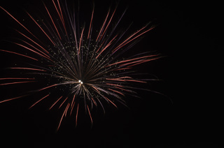            |             | 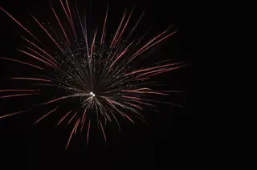               |
| Magick.Net     |                | 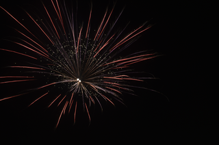               |                   |
| MagicScaler    |          | 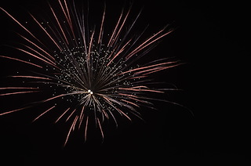         |             |
| NetVips        |                  | 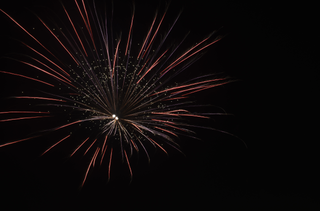               |                   |
| SkiaSharp      |                |                |                   |

- System.Drawing: The PNG is like the original. In the JPG there is this weird white-versus-color thing going on. I miss the red!. The skia-saved webp misses red.    
- ImageSharp: The PNG looks like the original. The JPG is fine compared to the original, but look at the WebP, the red is gone.    
- Magick.NET: The JPG is perfect, spot on. The PNG as well. The Webp: Where have the colors gone?  
- MagicScaler: The only package with a consistent behavior across formats. The JPG, PNG and WebP are all very similar, but they are all far too white, there is something wrong with the luminescence translation.  
- NetVips: The JPG and PNG are very good, but the WebP misses color.  
- SkiaSharp: Just looks dreadful with the artifacts, even the PNG. It handles the highlights just fine, but misses a bit of red.

### Resampling in High Quality

I configured the packages to output high quality images.

| Package        | JPG                                                                                                                               | PNG                                                                                                                           | Webp                                                                                                                              |
|----------------|-----------------------------------------------------------------------------------------------------------------------------------|-------------------------------------------------------------------------------------------------------------------------------|-----------------------------------------------------------------------------------------------------------------------------------|
| System.Drawing |  | 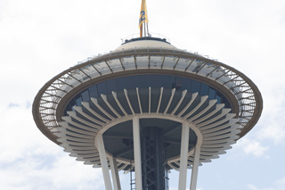 |  |
| ImageSharp     |             | 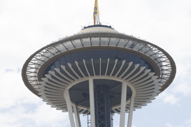            | 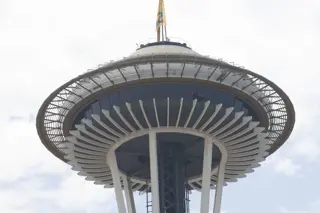               |
| Magick.Net     |                |                |                   |
| MagicScaler    |          |          |             |
| NetVips        |                  |                |                   |
| SkiaSharp      |                |                | 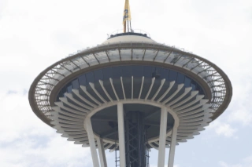                  |

- System.Drawing: Has the best quality for PNG, and a good JPG and WebP quality as well.
- ImageSharp: The Webp has weird artifacts, the JPG and PNG look good!  
- Magick.NET: All the different formats are similar in quality.  
- MagicScaler: Crisp and sharp, and consistent over the file formats, the highlights are too white overall.  
- NetVips: The quality is fine and quite consistent.  
- SkiaSharp: blurry and grey-ish blue.  

### Sharpening

As far as sharpening goes, I did not change the default settings for this test.

| Package        | JPG                                                                                                                               | PNG                                                                                                                           | Webp                                                                                                                              |
|----------------|-----------------------------------------------------------------------------------------------------------------------------------|-------------------------------------------------------------------------------------------------------------------------------|-----------------------------------------------------------------------------------------------------------------------------------|
| System.Drawing |  |  |  |
| ImageSharp     |             |             |                |
| Magick.Net     |                |                |                   |
| MagicScaler    |          |          |             |
| NetVips        |                  |                |                   |
| SkiaSharp      |                |                |                   |

None of the packages do anything wrong here, but in the details there are differences.

MagicScalar produces the sharpest images by far for all formats.
All other packages are fine, where SkiaSharp is a bit blurry.

#### Conclusion regarding picture quality

In the 80 px thumbnail category, the whites from MagicScaler are strong in all of the pictures. Skia looks blurry.
System.Drawing, ImageSharp and Magick.Net are fine.

The 320px category is where the differences between packages (or their settings) stand out the strongest. I reviewed the
picture quality with stars. Five stars meaning best quality, one star being bad and five stars means great. This very objective manner show the
differences between the packages for the different compression formats:

| Package        |  JPG |  PNG | Webp |                            Remarks |
|----------------|-----:|-----:|-----:|-----------------------------------:|
| System.Drawing |  *** | **** |  *** |                                    |
| ImageSharp     | **** | **** |  *** |                    Artifact issues |
| Magick.Net     |  *** | **** |  *** |                        |
| MagicScaler    |  *** |  *** |  *** |        Sharp, but highlight issues |
| NetVips        |  *** |  *** |  *** |                        |
| SkiaSharp      |    * |    * |    * | Artifact, blurriness, color issues |

System.Drawing has great PNG quality, but JPEG and WebP are just fine. There are some edge halo effects in the JPG and
blurriness in the Webp.

ImageSharp produces good JPG and PNG, but some WebP images are blurry and have artifacts. 

Magick.NET produces a nice PNG quality image, where some JPGs are a bit blurry and have some edge halo, the Webp is
even more blurry. Just a tiny bit more, compared to System.Drawing.

MagicScaler produces great pictures in all sizes with regard to sharpness. The low filesize is real magic, as it does not really seem to affect the quality. The downside of this package is the whitening in high contrast
scenarios. I'd like to know if there is a fix for that.

NetVips scores fine on all formats, but it is not as sharp as MagicScaler.

SkiaSharp is just blurry overall.

## Conclusion

All packages have their drawbacks, or specific use cases. For example, when designing a graphics-application for Android, despite its drawbacks, SkiaSharp is your go-to library. So read the table below with care.   
Also, there is the case of your business needs, for example, regarding the license types used. So I invite you to use my benchmark code, change the settings for the use case you have in mind, and choose the right package with the set of requirements you have in mind.

### Summarized:

| Package        | Pros                               | Cons                                                                                  | 
|----------------|:-----------------------------------|:--------------------------------------------------------------------------------------|
| System.Drawing | Popular (documentation support)    | Limited file-format support, windows-only                                             |
| Magick.Net     | File-format support                | Either good quality and large files OR low quality and small file-size                |
| MagicScaler    |                                    | Extreme highlights and sharpness affect quality                                       |
| ImageSharp     | Cross-platform                     | License for commercial use, high memory usage, small files result in bad webp quality |
| NetVips        | Cross-platform |                                                                                       |
| SkiaSharp      |                                    | Blurry images with lots of artifacts, hard to implement                               |

I experienced a lot of problems using System.Drawing, due to limited support for codecs, filetypes and color spaces. Personally I'd steer clear of this package, unless you have a very specific use case for it.  
Also. I'd avoid FreeImage, because it is not maintained anymore, and the quality of the images is mediocre. Spending time on tweaking the settings for this package is not worth it, in my opinion.

All the other packages are promising in their own way. I believe most of the downsides can be fixed, like the image quality for SkiaSharp, and the highlighting for MagicScaler.

## Resources

Inspiration:  
[.NET Core Image Processing](https://devblogs.microsoft.com/dotnet/net-core-image-processing/)

About jpeg:  
[JPEG definitive guide](https://www.thewebmaster.com/jpeg-definitive-guide/)

Packages:

[Webp in System.Drawing](https://learn.microsoft.com/en-us/dotnet/api/system.drawing.imaging.imageformat.webp?view=dotnet-plat-ext-8.0)  
[Issues in System.Drawing with Webp on GitHub](https://github.com/dotnet/runtime/issues/70418)    
[Issues in System.Drawing with Webp on StackOverflow](https://stackoverflow.com/questions/75988248/save-a-webp-file-with-system-drawing-imaging-generates-a-big-file-size-or-encode)  
[Image formats in System.Drawing](https://learn.microsoft.com/en-us/dotnet/api/system.drawing.imaging.imageformat?view=dotnet-plat-ext-8.0)

[Image formats in ImageSharp](https://docs.sixlabors.com/articles/imagesharp/imageformats.html)

[Image formats in Magick.Net](https://imagemagick.org/script/formats.php)

[MagicScaler](https://photosauce.net/blog/post/introducing-magicscaler)

[Image formats in SkiaSharp Xamarin](https://learn.microsoft.com/en-us/xamarin/xamarin-forms/user-interface/graphics/skiasharp/bitmaps/saving)  
[Image formats in SkiaSharp](https://learn.microsoft.com/en-us/dotnet/api/skiasharp.skencodedimageformat?view=skiasharp-2.88)

[Image formats in ImageFlow](https://docs.imageflow.io/json/encode.html)