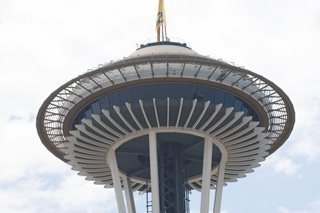
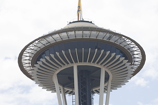
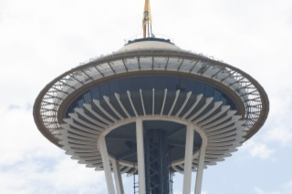
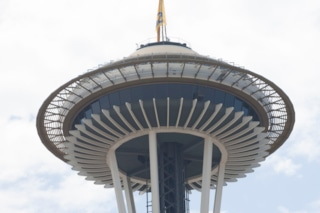
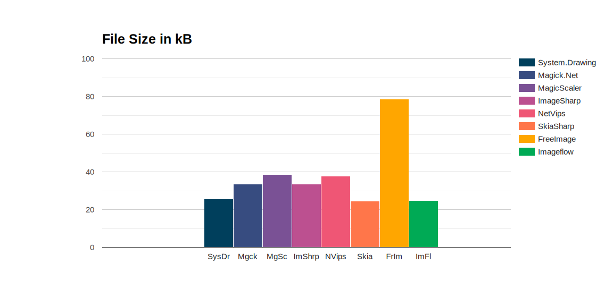
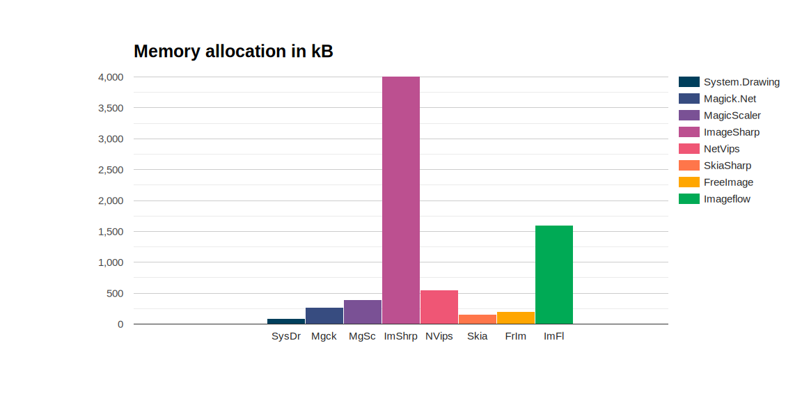
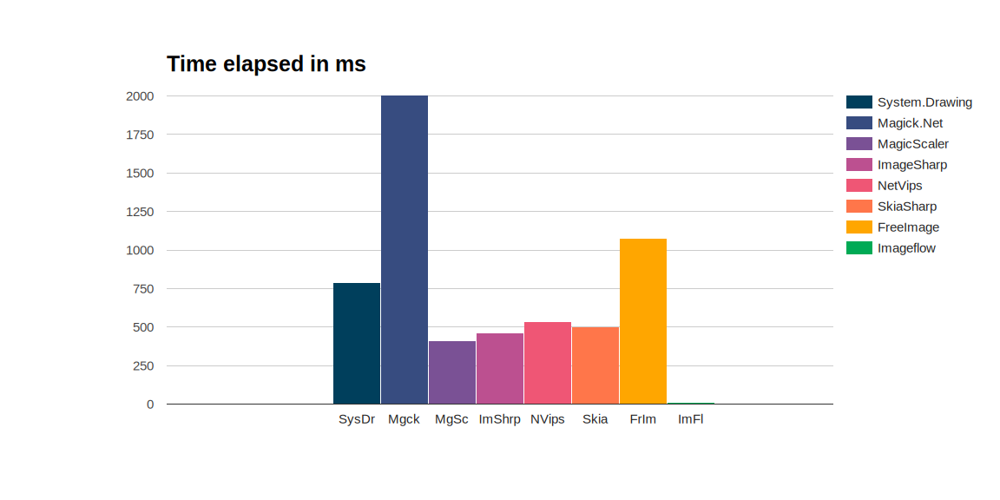

# Image resize in dotNet: from JPG to JPG on Windows OS

*2-4-2026*

## Introduction

A year has gone by since my latest blog, so here is image resize update!

I wondered: Can I resize images with a dotNet package? If so, what is the best package to use?  

I can give you the answers straight away:
- Yes, you can resize images with several dotNet packages.
- The best package depends on your use case.

Warning beforehand: I did not spend a lot of time tweaking the packages to get the best results. I think it should be possible to improve on my findings, taking the time to tweak the configuration. So this is an out-of-the-box kind of test.

I still have the [2024 blog](./imageresize.md) and the [2025 blog](./imageresize2025.md) on the site, so you can check what I have learned.

## Boundary conditions

This test:

- uses 12 pictures of 500kB size each, ~1280 x ~900 px by [Bertrand Le Roy](https://devblogs.microsoft.com/dotnet/net-core-image-processing/) plus 3 images of my own ~4000 x ~3000 px and 2-3MB.
- resizes to thumbnail size (~80px), small (320px) and medium (768px) sizes
- benchmarks the loading, resizing and saving operations with Benchmark.NET
- uses .NET 10 (LTS)
- uses Windows 11 only
- saves the images in jpeg format
- wants to achieve the highest image quality.

So, please keep in mind: this is not a real-world use case. In real life images are much larger. Also in most cases the quality requirements for thumbnails and bigger images differ.

## Considerations

I wanted to include at least the packages from the [2017 test by Bertrand Le Roy](https://devblogs.microsoft.com/dotnet/net-core-image-processing/):

- System.Drawing
- ImageSharp
- Magick.NET
- SkiaSharp
- FreeImage

I did some research, and included the following packages:

- ImageFlow
- [NetVips](https://github.com/kleisauke/net-vips), a wrap around the libvips library.

## About the packages

The implementation code is in my [GitHub imageresize.benchmark repository](https://github.com/HelmerDenDekker/helmer.imageresize.benchmark).

### System.Drawing.Common

This package provides access to GDI+ graphics (Windows) functionality.  
Please note that it has limited support.
See [System Drawing on Windows](https://aka.ms/systemdrawingnonwindows) for more information.  

Use case:  
It is a graphics library, so it is more than just image processing. It depends on the GDI+ library, the support for System.Drawing varies per library version and system the application is running on. System.Drawing.Common is only supported on Windows. 

Unique selling points:
- Popular package, well-known. It is well-documented, and there are lots of examples available, which makes it easy to learn and implement.
- It is a Microsoft package, so it is kept up-to-date.

Drawbacks:
- It is Windows only.
- The real support of file formats by this package is limited.
- Implementing image resizing feels weird for me, because it is a graphics library, drawing the resized image on a new bitmap.

### Magick.NET

Magick.NET is a wrapper around the [ImageMagick](https://imagemagick.org/index.php) library. There is a lot of functionality in this library, I recommend to check the website for more information. 

Use case:
Use this library if you want to use ImageMagick image processing functionality in dotNET. It is a powerful image manipulation library. And the file format support is amazing, it supports over 100 file formats. 

Unique selling points:
- Extensive file support.
- Batch processing optimizations.
- Ease of implementation
- Open-source

Drawbacks:
- Figuring out which nuget packages I needed for my computer took me more time than expected (2024).

### MagicScaler

MagicScaler is a high-performance image processing pipeline for .NET, focused on making complex imaging tasks simple.
They claim their speed and efficiency are unmatched by anything else on the .NET platform.  
Let's see about that later.

Use case:
Image processing library with clever default settings. It generates images optimized per use case with default settings. So a thumbnail will be sharper, better highlighted and of smaller size by default, compared to a larger image. 

Unique selling points:
- Ease of implementation. It is quite clever by default, making it easy to get optimized-per-use-case images without any hassle.
- Speed and efficiency. It is claimed to be the fastest image processing library for .NET.

Drawbacks:
- It is still on version 0, this might indicate there is no production version available yet.
- I am not sure that it is compatible with other platforms than Windows and Linux.

### ImageSharp

ImageSharp is a fully featured, fully managed, cross-platform, 2D graphics library. Fully managed means there is no dependency on native libraries or interop code. 
It is quite easy to implement. I had to fiddle a little bit, but it was not that difficult.

Use case:
Cross-platform graphics library.

Unique selling points:
- Cross-platform (I did not test this!)
- Ease of implementation (Easy to use API).

Drawbacks:  
- The license. It is a split license, which is not a problem for most developers, but it could be a problem for some
  managers.

### NetVips

NetVips is a .NET wrapper around the libvips library. It is cross-platform and has a lot of image processing functions. It supports Windows, Linux and macOS.

Use case:
Easy to implement image processing library for .NET Framework (>=4.52) and .NET >6.0.

Unique selling points:
- It supports Windows, Linux and MacOS (I did not test this).
- Pipeline-like implementation, which is quite clever.
- Documentation is good.
- Speed and efficiency. It is claimed to be the fastest image processing library for .NET.

### SkiaSharp

SkiaSharp is a wrapper around [Google's Skia Graphics library](https://skia.org/). Skia is an open source 2D graphics
library which provides common APIs that work across a variety of hardware and software platforms. It serves as the
graphics engine for Google Chrome and ChromeOS, Android, Flutter, and many other products.

Use case:
Cross-platform graphics library.

Unique selling points:
- It was made for fast image processing.
- It is cross-platform.
- It is a Google package, so it is well-supported (in theory).

Drawbacks:
- The documentation is a bit lacking. It took me more time than expected to figure stuff out.
- You need to know a lot of tricks to get the quality right for one use case. So to get to, say, MagicScaler level you need an enormous amount of extra code. Code equals time.
- The speed of development is high. Which is a good thing, but with a lack of documentation you need to dive into source code to understand it. The development speed out-dates a lot of documentation, examples and questions, leaving you on the wrong foot most of the time.

### Free Image

I only included this package because it was in the previous test. It is a .NET wrapper around the FreeImage library.
This library is no longer maintained, and it seems FreeImage.NET is also no longer maintained.

Unique selling points:
- The only wrapper around the FreeImage library.

Drawbacks:
- It is not maintained anymore.
- Makes me want to take a shower after viewing the implementation code. Ugly and hard to understand implementation for developers. Good for image-nerds.

### ImageFlow

Imageflow.NET is a .NET API for [Imageflow](https://github.com/imazen/imageflow), an image optimization and processing library for web servers.
It focuses on security, quality, and performance - in that order. Imageflow.NET is compatible with .NET 4.6.2+, .NET Core 2.0+, and .NET 5/6/7/8.

Use case:
Image processing library for web servers.

Unique selling points:
- It is cross-dotNET-platform.
- Image processing for web servers.

Drawbacks:
- ImageFlow.NET is tri-licensed under a commercial license, the AGPLv3, and the Apache 2 license, which would drive any
manager mad.
- The implementation for me still feels weird in 2026. I know there is an idea behind it, but please provide a bit more documentation. I had to dive into the source code in order to find out how to use this.
- ImageFlow is still on version 0, this might indicate there is no production version available yet.
- I thought I fixed saving the images, however, after a certain amount of images bing processed, it no longer saves them. So, there still seems to be a problem somewhere...

### Packages summarized

A summary of the packages used in this table:

| Package                                                                  |                                                                               License | Published | Version | Downloads |
|--------------------------------------------------------------------------|--------------------------------------------------------------------------------------:|----------:|--------:|----------:|
| [System.Drawing](https://www.nuget.org/packages/System.Drawing.Common)   |                                MIT |    3-2025 |  10.0.5 |  2500.0 M |
| [Magick.Net](https://www.nuget.org/packages/Magick.NET.Core)             |                                                                            Apache 2.0 |    3-2026 | 14.11.1 |    47.1 M |
| [MagicScaler](https://www.nuget.org/packages/PhotoSauce.MagicScaler)     |                                                                                   MIT |   12-2024 |  0.15.0 |     2.0 M |
| [ImageSharp](https://www.nuget.org/packages/SixLabors.ImageSharp)        | [Six Labors split](https://www.nuget.org/packages/SixLabors.ImageSharp/3.1.1/license) |   12-2025 |  3.1.12 |   234.7 M |
| [NetVips](https://www.nuget.org/packages/NetVips)                        |                                                                                   MIT |    1-2026 |   3.2.0 |     2.4 M |
| [SkiaSharp](https://www.nuget.org/packages/SkiaSharp)                    |                                                                                   MIT |    1-2026 | 3.119.2 |     249 M |
| [FreeImage](https://www.nuget.org/packages/FreeImage.Standard)           |                           [Free Image](https://freeimage.sourceforge.io/license.html) |    6-2019 |   4.3.8 |     0.2 M |
| [ImageFlow](https://www.nuget.org/packages/Imageflow.Net)                |                                                                tri or bi-license AGPL |    3-2026 |  0.15.1 |     1.7 M |
  
I added the license information for your managers if you want to use this software in company code. I find managers to
often dislike (or forbid) copyleft-type licenses.

Most of the packages are in full support or development, except Free Image which has not been updated for a while.
System.Drawing and SkiaSharp are Microsoft backed packages. This could be an advantage in terms of support.

MagicScaler and ImageFlow are still on the zero version, which might indicate there is no official production version
yet.

System.Drawing.Common is the most popular with 1124 million downloads!!   
ImageSharp comes second, closely followed by SkiaSharp. A far fourth is Magick.NET.   
MagicScaler and ImageFlow are promising packages, but they are not that popular.

## About the pictures

The pictures were chosen on-purpose. 

This picture of the lamp has a sRGB color space and contains an embedded color profile.
The picture of the hummingbird has a sRGB color space as well.
The other 10 pictures have an Adobe RGB color space (Uncalibrated) with an embedded profile for sRGB.

## Quality

The quality of a picture is subjective. Also, let me remind you that with any package it is possible to reach a certain level of quality.
For this test I used a limited amount of time.

### ColorSpace management

Most applications use sRGB colorSpace to show a jpg picture. However, there is not such a thing as a default colorSpace. There are several color profiles in-use, and if the developer does not use the right settings to handle this, the picture will look terrible.
I changed the settings for most of the libraries to do a conversion to sRGB.
This conversion step will slow the process down, but I'd rather have a slow process than faulty colors.

The picture of Wild River has an Adobe RGB profile, which has to be converted to sRGB. Because of the blue, it will show if I have the settings wrong. 

This is the original picture, notice the blue.

The blue in the pictures below should be unchanged (same shade of blue) in the ideal case.

| Package        |                                                                                                                      |  
|----------------|---------------------------------------------------------------------------------------------------------------------:|
| System.Drawing |  |
| Magick.Net     |                |
| MagicScaler    |          |
| ImageSharp     |             |
| NetVips        |                      |
| SkiaSharp      |            |
| FreeImage      |                |
| ImageFlow      |                |

I did not change any settings for this version, so any color mangling comes out of the box.  
- System.Drawing handles colorspace management for blue just fine.
- Magick.NET does some color mangling, but this can be fixed by keeping the icc-profile in the image, which I did not do for this test. So, this is a settings issue, not a package issue.
- MagicScaler has the right blue, but seems to be a bit brighter or sharper.
- ImageSharp has the right blue.
- NetVips looks like ImageSharp, the right blue color.
- SkiaSharp handles the color space management well, it seems to be a bit darker, and it has other issues.
- FreeImage does color mangling, this might be prevented with the right setting.
- ImageFlow has the right color of blue, but it is a bit brighter.

The result shows the work to be done in setting up the Magick.NET and FreeImage packages to correctly handle the color space management.

### Highlights

When resampling from one ColorSpace to another, the luminescence is not translated correctly. For this Gamma-correction is needed.
I did not change these settings for this test. This is extremely noticeable in dark pictures with sharp light features. If the wrong correction is used, the light will be much brighter, and the darks will be darker.

| Package        |                                                                                                                                     |  
|----------------|------------------------------------------------------------------------------------------------------------------------------------:|
| System.Drawing |  |
| Magick.Net     |                  |
| MagicScaler    |            |
| ImageSharp     |               |
| NetVips        |                        |
| SkiaSharp      |              |
| FreeImage      |                  |
| ImageFlow      |                  |

This shows some major differences in the handling of highlights between the packages.
- System.Drawing handles highlights okay, but seems to lose a bit of redness.
- Magick.NET handles highlights nicely.
- MagicScaler say they have the best highlighting, but in this test it reflects all the problems. The light is too bright, the color is gone. I talked about this extensively in the [2024 image format blog](./imageresizetx.md). The smaller the image size, the bigger the problem.
- ImageSharp handles highlights the best. It looks like the original.
- NetVips handles highlights well, comparable to ImageSharp.
- SkiaSharp... I don't know. The lines are messed up, basically useless. I do not think the gamma correction is to blame for this. Skipping the way it looks, it highlights just a bit too much.
- FreeImage handles highlights well, comparable to ImageSharp.
- ImageFlow clearly emphasizes the highlights, but it is not as bad as MagicScaler.

### Resampling in High Quality

I configured the packages to output high quality images.

| Package        |                                                                                                                         |  
|----------------|------------------------------------------------------------------------------------------------------------------------:|
| System.Drawing |  |
| Magick.Net     |                  |
| MagicScaler    |            |
| ImageSharp     |               |
| NetVips      |                        |
| SkiaSharp      |              |
| FreeImage      |                  |
| FreeImage      |                  |

MagicScaler and System Drawing have the sharpest images.
SkiaSharp and FreeImage are blurry and have weird artifacts.

### Sharpening

As far as sharpening goes, I did not change the default settings for this test.

| Package        |                                                                                                                         |  
|----------------|------------------------------------------------------------------------------------------------------------------------:|
| System.Drawing |  |
| Magick.Net     |                  |
| MagicScaler    |            |
| ImageSharp     |               |
| NetVips      |                        |
| SkiaSharp      |              |
| FreeImage      |                  |
| ImageFlow      |                  |

MagicScaler clearly has the sharpest picture of them all.  
Closely followed by Magick.NET and System.Drawing.

#### Conclusion regarding picture quality

| Package        | Colors | Highlights | Sharpness |
|----------------|-------:|-----------:|----------:|
| System.Drawing |   **** |        low |     sharp |
| Magick.Net     |      * |    perfect |     sharp |
| MagicScaler    |  **** |   too high |  sharpest |
| ImageSharp     |  ***** |    perfect |     sharp |
| NetVips        |  ***** |    perfect |     sharp |
| SkiaSharp      |  **** |        low |    blurry |
| FreeImage      |      * |    perfect |    blurry |
| ImageFlow      |  ***** |       high |    blurry |

## Results in numbers

The results of this test in numbers: the time elapsed to produce the pictures, the memory used and the resulting
filesize.

### File size

Last blog, I kept the icc-profile for MagickNet to convert the color space. This time I did not, and so the colors are off, but the filesize is low for this package.

So, in the end, the filesize reflects more on my abilities to find the right settings in the library in a restricted amount of time, while keeping the processing at a certain level, than it says about the qualities of the library itself.

### Memory allocation

For measuring the memory allocation I used benchmark.NET with a low iteration count, so do not look at the absolute numbers, but rather to the ratio's.

Because of the changed settings, Magick.Net uses a lot less memory compared to the 2025-blog. ImageSharp still uses a lot of memory, but ImageFlow is absolute king. I think that may have been my mistake, because I did not take any time to optimize this. The library has lots of options to handle opening and processing of images. I just used the shortest route to result.  

### Total time elapsed

For measuring the total time elapsed I used benchmark.NET with a low iteration count. Also, keep in mind I have the code optimized for quality and low file size, not for speed!

Magick.Net is the slowest (off the chart). Imageflow is speed-king. System.Drawing is a bit slower, the others take around 500ms.

## Conclusion

All packages have their drawbacks, or specific use cases. For example, when designing a graphics-application for Android, despite its drawbacks, SkiaSharp is your go-to library. So read the table below with care.   
Also, there is the case of your business needs, for example, regarding the license types used. So I invite you to use my benchmark code, change the settings for the use case you have in mind, and choose the right package with the set of requirements you have in mind.

### Summarized:

| Package        | Pros                               | Cons                                                                                                                                        | 
|----------------|:-----------------------------------|:--------------------------------------------------------------------------------------------------------------------------------------------|
| System.Drawing | Popular (documentation support)    | Windows-only, limited file-format support                                                                                                   |
| Magick.Net     | File-format support                | Either good quality and large files OR low quality and small file-size                                                                      |
| MagicScaler    |                                    | Extreme highlights and sharpness affect quality                                                                                             |
| ImageSharp     | Cross-platform                     | License for commercial use, high memory usage                                                                                               |
| NetVips        | Cross-platform, good image quality |                                                                                                                                             |
| SkiaSharp      |                                    | Blurry images with lots of artifacts, hard to implement                                                                                     |
| FreeImage      |                                    | Blurry images with mangled colors, license for commercial use, out-dated, large filesize                                                    |
| ImageFlow      | Fast                               | Blurry images, license for commercial use, huge memory allocation => images not always saved, lacks documentation for dotnet implementation |

I experienced a lot of problems using System.Drawing, due to limited support for codecs, filetypes and color spaces. Personally I'd steer clear of this package, unless you have a very specific use case for it.  
Also. I'd avoid FreeImage, because it is not maintained anymore, and the quality of the images is mediocre. Spending time on tweaking the settings for this package is not worth it, in my opinion.

All the other packages are promising in their own way. I believe most of the downsides can be fixed, like the image quality for SkiaSharp, and the highlighting for MagicScaler.

## Resources

Inspiration:  
[.NET Core Image Processing](https://devblogs.microsoft.com/dotnet/net-core-image-processing/)

Packages:  
[PhotoSauce](https://photosauce.net/)  
[System.Drawing](https://www.nuget.org/packages/System.Drawing.Common)  
[ImageSharp](https://github.com/SixLabors/ImageSharp)  
[Magick.Net](https://github.com/dlemstra/Magick.NET)  
[SkiaSharp](https://github.com/mono/SkiaSharp)  
[FreeImage](https://github.com/LordBenjamin/FreeImage.Standard)  
[ImageFlow](https://github.com/imazen/imageflow-dotnet)  

