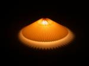

# Image resize in dotNet: from JPG to JPG on Windows OS
*1-1-2024*

## Intro

For the new [Team Xerbutri](https://github.com/TeamXerbutri) website, the guys asked me to improve the imagery.

That is a bit of a broad question.

So, I set of with resizing, what sizes are used on web these days? Also the resizing process takes a lot of time, and was done in old programs, batch processing the stuff in Jasc and saving the images multiple times as jpg, degrading the picture quality. Time for some modernization and automization of this process.

My Question:  
Can I resize images with a dotNet package? If so, what is the best package to use?

## Boundary conditions

In this test I used the 12 pictures by [Bertrand Le Roy](https://devblogs.microsoft.com/dotnet/net-core-image-processing/).  
I am running almost exactly the same benchmark, updated slightly to 2023.

In this test:
- uses 12 pictures of 500kB size each, ~1280 x ~900 px 
- resizes to thumbnail size (150px)
- benchmarking of load, resize and save operations
- using .NET 8
- using Windows 11 only
- save the original jpeg as 75% quality jpeg format

## Considerations

I wanted to include at least the packages from the [original test by Bertrand Le Roy](https://devblogs.microsoft.com/dotnet/net-core-image-processing/):
- System.Drawing, the newest version named System.Drawing.Common
- ImageSharp
- Magick.NET
- SkiaSharp
- FreeImage

I did some research, and considered the following packages.
- ImageFlow, which I added to the test
- Microsoft.Maui.Graphics. I tried, but there is no support for Windows 11 at this moment, leaving you the choice to wrap around System.Drawing (already in this test) or SkiaSharp (also in this test) 
- [Image resizer](https://discoverdot.net/projects/image-resizer), which is for .NET framework. For .NET 8 it recommends to use ImageFlow.
- [ImageProcessor](https://github.com/JimBobSquarePants/ImageProcessor)  which is for .NET framework and is dead. It was a wrapper around System.Drawing (in this test). It recommends ImageSharp for .NET (Core).

## About the packages

The implementation code is in my [GitHub imageresize.benchmark repository](https://github.com/HelmerDenDekker/helmer.imageresize.benchmark). 

### System.Drawing.Common

This package provides access to GDI+ graphics (Windows) functionality.  
Non-Windows platforms are not supported since .NET 7, even with the runtime configuration switch. See [System Drawing on Windows](https://aka.ms/systemdrawingnonwindows) for more information.
It is very popular and for its many versions there are lots of examples. The implementation is a bit more messy compared to ImageSharp or Magick.NET.

### ImageSharp

ImageSharp is a fully featured, fully managed, cross-platform, 2D graphics library.  
It is quite easy to implement. I had to fiddle a little bit, but it was not that hard.

### Magick.NET

Magick.NET is a wrapper around the [ImageMagick](https://imagemagick.org/index.php) library. It has extensive file support.  
Code implementation is very clean and very easy, but I had to figure out which nuget package(s) to use.

### MagicScaler

MagicScaler is a high-performance image processing pipeline for .NET, focused on making complex imaging tasks simple. They claim their speed and efficiency are unmatched by anything else on the .NET platform.  
Let's see about that later.  

The implementation took a bit of fiddling around since I wanted to control the output size of the picture.  

//Version 0

### SkiaSharp

SkiaSharp is a wrapper around [Google's Skia Graphics library](https://skia.org/). Skia is an open source 2D graphics library which provides common APIs that work across a variety of hardware and software platforms. It serves as the graphics engine for Google Chrome and ChromeOS, Android, Flutter, and many other products.

Making this library work on Windows 11 took me no effort at all, and for me it worked out of the box. The implemented code looks a bit strange to me, and I relied heavily on some examples I found online. However, microsoft have pages about skia in their documentation, so I guess it has their full support, which is nice.

### Free Image

I only included this package because it was in the previous test. It is a .NET wrapper around the FreeImage library. This library is no longer maintained, and it seems FreeImage.NET is also no longer maintained.

### ImageFlow

Imageflow.NET is a .NET API for [Imageflow](https://github.com/imazen/imageflow), the fast image optimization and processing library for web servers. Imageflow focuses on security, quality, and performance - in that order. Imageflow.NET is a .NET Standard 2.0 library, and as such is compatible with .NET 4.6.2+, .NET Core 2.0+, and .NET 5/6/7/8.  
Imageflow.NET is tri-licensed under a commercial license, the AGPLv3, and the Apache 2 license.  
// implementation?  
// Version 0  

### Package summarized

A summary of the packages used in this table:

| Package                                                                |                                                                               License | Published | Version | Downloads |
|------------------------------------------------------------------------|--------------------------------------------------------------------------------------:|----------:|--------:|----------:|
| [System.Drawing](https://www.nuget.org/packages/System.Drawing.Common) |                                                                                   MIT |   11-2023 |   6.0.0 |  1124.1 M |
| [ImageSharp](https://github.com/SixLabors/ImageSharp)                  | [Six Labors split](https://www.nuget.org/packages/SixLabors.ImageSharp/3.1.1/license) |   12-2023 |   3.1.1 |    77.6 M |
| [Magick.Net](https://github.com/dlemstra/Magick.NET)                   |                                                                            Apache 2.0 |   12-2023 |  13.5.0 |    15.0 M |
| [MagicScaler](https://www.nuget.org/packages/PhotoSauce.MagicScaler)   |                                                                                   MIT |   10-2023 |  0.14.0 |     0.7 M |
| [SkiaSharp](https://github.com/mono/SkiaSharp)                         |                                                                                   MIT |    9-2023 |  2.88.6 |    69.1 M |
| [FreeImage](https://github.com/LordBenjamin/FreeImage.Standard)        |                           [Free Image](https://freeimage.sourceforge.io/license.html) |    6-2019 |   4.3.8 |    0.07 M |
| [ImageFlow](https://github.com/imazen/imageflow-dotnet)                |                                                            AGPL >=3.0 or Apache >=2.0 |    9-2023 |  0.10.2 |     0.3 M |

I added the license information for your managers if you want to use this software in company code. I find managers to often dislike (or forbid) copyleft-type licenses.  

Most of the packages are in full support or development, except Free Image which has not been updated for a while. System.Drawing and Skiasharp are Microsoft backed packages. This could be an advantage in terms of support.

MagicScaler and ImageFlow are still on the zero version, which might indicate there is no official production version yet.  

System.Drawing.Common is the most popular with 1124 million downloads!!   
ImageSharp comes second, closely followed by SkiaSharp. A far fourth is Magick.NET.   
MagicScaler and ImageFlow are promising packages, but they are not that popular.

## Results in numbers

The results of this test

### Speed

The time elapsed is just an indication, as run on my laptop. So please just focus on the ratio.

These is the speed per operation as output from benchmark dotnet. 
ImageFlow is off the chart, this is not a mistake. It is fast as lightning! At least the speed per operation is. ImageFlow spins up a huge amount of operations, so one operation is very fast. However, it does take a lot of operations and overhead to get this done.

Let's look at the total time elapsed:

This looks very very different! ImageFlow is now slowest! Spinning up >500 operations has the downside of having a lot of overhead on my system, in this test. Another test may have another outcome!
Magick.NET is now the fastest package overall, while being the slowest package per operation. 

In this case I am not interested in per operation statistics, I want to know how long it takes to resize all of my images.

For this test, loading, resizing and saving with 12 images of 0,5 MB size:
Magick.NET is clearly fastest, and ImageFlow is the slowest.

I will create another test for the Xerbutri case later, bu I wanted to be able to compare with the results by 

### Memory usage

For your machine this does not matter, but having functions or other stuff in the cloud where you pay (or simply crash on memory overload), this is the allocated memory usage.

Low mem usage for System.Drawing, Magick.NET, SkiaSharp and FreeImage
Having many operations takes its toll on the memory usage of ImageFlow.

ImageSharp has by far the highest memory usage and is a bit absurd, taking twice the amount of a picture-size on disk. I am interested in the performance of these package with larger pictures.

[//]: # ()
[//]: # ()
[//]: # (| Package        |      Gen0 |      Gen1 |      Gen2 |    Allocated | Alloc Ratio |)

[//]: # (|----------------|----------:|----------:|----------:|-------------:|------------:|)

[//]: # (| System.Drawing |         - |         - |         - |     45.27 KB |        1.00 |)

[//]: # (| ImageSharp     |         - |         - |         - |   1323.16 KB |       29.23 |)

[//]: # (| Magick.Net     |         - |         - |         - |     59.98 KB |        1.32 |)

[//]: # (| MagicScaler    |         - |         - |         - |    152.05 KB |        3.36 |)

[//]: # (| SkiaSharp      |         - |         - |         - |      95.3 KB |        2.11 |)

[//]: # (| FreeImage      | 6000.0000 | 6000.0000 | 6000.0000 |    100.49 KB |        2.22 |)

[//]: # (| ImageFlow      |    42.9688 |   39.0625 |  35.1563  |   247.35 KB |        5.46 |)

[//]: # ()
[//]: # (*Legends*  )

[//]: # (- Gen0        : GC Generation 0 collects per 1000 operations)

[//]: # (- Gen1        : GC Generation 1 collects per 1000 operations)

[//]: # (- Gen2        : GC Generation 2 collects per 1000 operations)

[//]: # (- Allocated   : Allocated memory per single operation &#40;managed only, inclusive, 1KB = 1024B&#41;)

[//]: # (- Alloc Ratio : Allocated memory ratio distribution)

### File size

//ToDo create a bar graph

| Package        |   Size |  
|----------------|-------:|
| System.Drawing | 6,3 KB |
| ImageSharp     | 6,7 KB |
| Magick.Net     | 6,7 KB |
| MagicScaler    | 6,7 KB |
| SkiaSharp      | 4,0 Kb |
| FreeImage      | 5,3 KB |
| ImageFlow      | 4,0 KB |

Size is average size on disk 

## Quality

Subjective

| Package        |                                                                                                               |  
|----------------|--------------------------------------------------------------------------------------------------------------:|
| System.Drawing |  |
| ImageSharp     |             |
| Magick.Net     |                |
| MagicScaler    |          |
| SkiaSharp      |                |
| FreeImage      |                |
| ImageFlow      |                |

| Package        |                                                                                                               |  
|----------------|--------------------------------------------------------------------------------------------------------------:|
| System.Drawing |  |
| ImageSharp     |             |
| Magick.Net     |                |
| MagicScaler    |          |
| SkiaSharp      |                |
| FreeImage      |                |
| ImageFlow      |                |

| Package        |                                                                                                               |  
|----------------|--------------------------------------------------------------------------------------------------------------:|
| System.Drawing |  |
| ImageSharp     |             |
| Magick.Net     |                |
| MagicScaler    |          |
| SkiaSharp      |                |
| FreeImage      |                |
| ImageFlow      |                |

| Package |                                                                                                System.Drawing |                                                                                         ImageSharp |                                                                                      Magick.Net |                                                                                           MagicScaler |                                                                                       SkiaSharp |                                                                                       FreeImage |                                                                                       ImageFlow |
|--------:|--------------------------------------------------------------------------------------------------------------:|---------------------------------------------------------------------------------------------------:|------------------------------------------------------------------------------------------------:|------------------------------------------------------------------------------------------------------:|------------------------------------------------------------------------------------------------:|------------------------------------------------------------------------------------------------:|------------------------------------------------------------------------------------------------:|
|       1 |  |  |  |  |  |  |  |
|       2 |  |  |  |  |  |  |  |
|       3 |  |  |  |  |  |  |  |
|       4 |  |  |  |  |  |  |  |
|       5 |  |  |  |  |  |  |  |
|       6 |  |  |  |  |  |  |  |
|       7 |  |  |  |  |  |  |  |
|       8 |  |  |  |  |  |  |  |
|       9 |  |  |  |  |  |  |  |
|      10 |  |  |  |  |  |  |  |
|      11 |  |  |  |  |  |  |  |
|      12 |  |  |  |  |  |  |  |

Best quality in this test:

System.Drawing
ImageSharp
MagicScaler

Good:
ImageFlow, bit blurry

SkiaSharp is blurry and colors are off
FreeImage colors are off
Magick.NET colors are off

Differences: skiaSharp became worse on update

## Remarks

Remarks on the results:

First of all: Who does this?
I mean: If you like images, who is going to turn a jpeg into a jpeg, because you are destroying the image, right?
You would more likely save it as a PNG, or as a Webp image file. More about that in an upcoming blog!

You could set required output, like file-size or quality and achieve different results. For example, there are complaints about the image quality by the SkiaSharp package, but on the github issues you will find tricks to improve image quality. The scope of this test was to have comparable input, and compare the output ogf the packages. I am not sure this is fair.

## Follow up

- The pictures should have a watermark  
- The supported formats should be JPEG (.jpg), WEBP (.webp) and Portable Network Graphics (.png)  
- A program that should ultimately have functionality comparable to [Easy Thumbnails](https://www.fookes.com/easy-thumbnails) (in use by the team these days):
  - Batch process to **scale down** to different sizes for web
  - Batch process to save as different picture formats
  - Batch process to add a watermark to all pictures except thumbnails
- The program should run on iOS and Windows. 

Following post: Image format support.

## Resources

Inspiration:  
[.NET Core Image Processing](https://devblogs.microsoft.com/dotnet/net-core-image-processing/)

Packages:  
[PhotoSauce](https://photosauce.net/)

