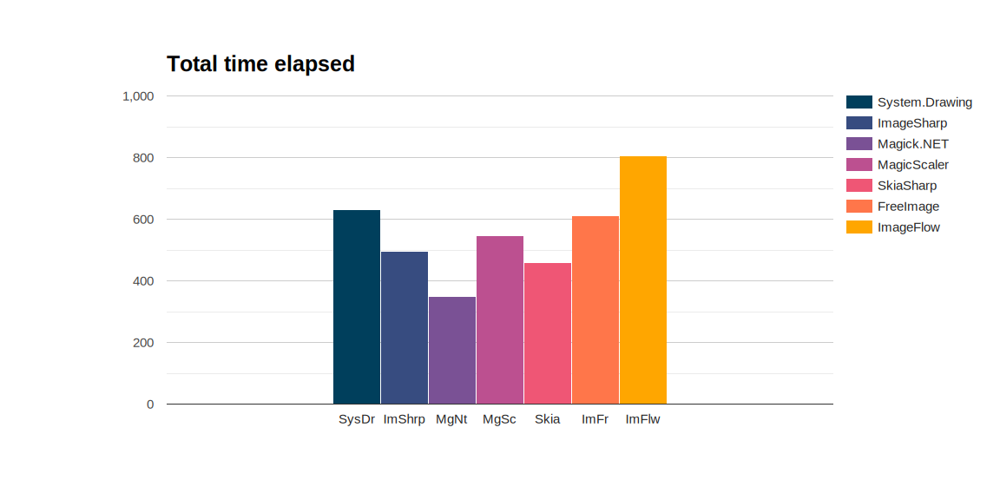

# Image resize in dotNet: from JPG to JPG on Windows OS

*1-1-2024 - updated 16-1-2024*

## Introduction

The guys of [Team Xerbutri](https://github.com/TeamXerbutri) asked me to improve the imagery on their new website.

That is a bit of a broad question, so where to start?

What image formats are in play these days? What sizes are used? What is the most expensive process?

Image resizing is the most expensive process.

Resizing and adding watermarks takes a lot of time, and was done in old applications, batch processing the pictures in
Jasc PSP and saving the images multiple times as jpg, degrading the picture quality. In the wake of the modernization
and automation of this process I will write some blogposts.

My Question:  
Can I resize images with a dotNet package? If so, what is the best package to use?

## Boundary conditions

In this test I used the 12 pictures
by [Bertrand Le Roy](https://devblogs.microsoft.com/dotnet/net-core-image-processing/).  
I am running almost exactly the same benchmark, updated slightly to 2023.

In this test:

- uses 12 pictures of 500kB size each, ~1280 x ~900 px
- resizes to thumbnail size (150px)
- benchmarking of load, resize and save operations
- using .NET 8
- using Windows 11 only
- saves the original jpeg as 75% quality jpeg format

## Considerations

I wanted to include at least the packages from
the [2017 test by Bertrand Le Roy](https://devblogs.microsoft.com/dotnet/net-core-image-processing/):

- System.Drawing, the newest version named System.Drawing.Common
- ImageSharp
- Magick.NET
- SkiaSharp
- FreeImage

I did some research, and considered the following packages.

- ImageFlow, which I added to the test
- Microsoft.Maui.Graphics. I tried, but there is no support for Windows 11 at this moment, leaving you the choice to
  wrap around System.Drawing (already in this test) or SkiaSharp (also in this test)
- [Image resizer](https://discoverdot.net/projects/image-resizer), which is for .NET framework. For .NET 8 it recommends
  to use ImageFlow.
- [ImageProcessor](https://github.com/JimBobSquarePants/ImageProcessor)  which is for .NET framework and is dead. It was
  a wrapper around System.Drawing (in this test). It recommends ImageSharp for .NET (Core).

## About the packages

The implementation code is in
my [GitHub imageresize.benchmark repository](https://github.com/HelmerDenDekker/helmer.imageresize.benchmark).

### System.Drawing.Common

This package provides access to GDI+ graphics (Windows) functionality.  
Non-Windows platforms are not supported since .NET 7, even with the runtime configuration switch.
See [System Drawing on Windows](https://aka.ms/systemdrawingnonwindows) for more information.
It is very popular and for its many versions there are lots of examples. The implementation is a bit more messy compared
to ImageSharp or Magick.NET.

### ImageSharp

ImageSharp is a fully featured, fully managed, cross-platform, 2D graphics library.  
It is quite easy to implement. I had to fiddle a little bit, but it was not that difficult.

### Magick.NET

Magick.NET is a wrapper around the [ImageMagick](https://imagemagick.org/index.php) library. It has extensive file
support.  
Code implementation is very clean and very easy, but I had to figure out which nuget package(s) to use.

### MagicScaler

MagicScaler is a high-performance image processing pipeline for .NET, focused on making complex imaging tasks simple.
They claim their speed and efficiency are unmatched by anything else on the .NET platform.  
Let's see about that later.

This package currently has full functionality only on Windows.

The implementation took a bit of fiddling around since I wanted to control the output size of the picture.

MagicScaler is still on version 0, this might indicate there is no production version available yet.

### SkiaSharp

SkiaSharp is a wrapper around [Google's Skia Graphics library](https://skia.org/). Skia is an open source 2D graphics
library which provides common APIs that work across a variety of hardware and software platforms. It serves as the
graphics engine for Google Chrome and ChromeOS, Android, Flutter, and many other products.

Making this library work on Windows 11 took me no effort at all, and for me it worked out of the box. The implemented
code looks a bit strange to me, and I relied heavily on some examples I found online. However, microsoft have pages
about skia in their documentation, so I guess it has their full support, which is nice.

### Free Image

I only included this package because it was in the previous test. It is a .NET wrapper around the FreeImage library.
This library is no longer maintained, and it seems FreeImage.NET is also no longer maintained.

Implementation is the shortest with just 4 lines of code. It is however a bit ugly in style and hard to understand at
first sight because of the descriptive nature. For example: JPEG_QUALITYGOOD means 75%. For me, having worked with
images for all my life, 75% is very clear to me. I will never say this picture-compression will be good or have any
quality. It makes me feel bad.

### ImageFlow

Imageflow.NET is a .NET API for [Imageflow](https://github.com/imazen/imageflow), an image optimization and processing
library for web servers. Imageflow focuses on security, quality, and performance - in that order. Imageflow.NET is a
.NET Standard 2.0 library, and as such is compatible with .NET 4.6.2+, .NET Core 2.0+, and .NET 5/6/7/8.

Imageflow.NET is tri-licensed under a commercial license, the AGPLv3, and the Apache 2 license, which would drive any
manager mad.

The implementation for me feels crazy. If you are familiar to ImageResizer, you may disagree with me but... ARGH!!
Cooties!! I copied an example piece of code. And I hate it. It has all the expensive stuff in it which I always try to
avoid. It is the only async one. It has the ResizerCommands from the old ImageResizer package. For me it feels awkward.
I think I could easily improve this piece of code to make me feel less itchy, but I do not want to touch it.
ImageFlow is still on version 0, this might indicate there is no production version available yet.

### Packages summarized

A summary of the packages used in this table:

| Package                                                                |                                                                               License | Published | Version | Downloads |
|------------------------------------------------------------------------|--------------------------------------------------------------------------------------:|----------:|--------:|----------:|
| [System.Drawing](https://www.nuget.org/packages/System.Drawing.Common) |                                                                                   MIT |   11-2023 |   6.0.0 |  1124.1 M |
| [ImageSharp](https://github.com/SixLabors/ImageSharp)                  | [Six Labors split](https://www.nuget.org/packages/SixLabors.ImageSharp/3.1.1/license) |   12-2023 |   3.1.1 |    77.6 M |
| [Magick.Net](https://github.com/dlemstra/Magick.NET)                   |                                                                            Apache 2.0 |   12-2023 |  13.5.0 |    15.0 M |
| [MagicScaler](https://www.nuget.org/packages/PhotoSauce.MagicScaler)   |                                                                                   MIT |   10-2023 |  0.14.0 |     0.7 M |
| [SkiaSharp](https://github.com/mono/SkiaSharp)                         |                                                                                   MIT |    9-2023 |  2.88.6 |    69.1 M |
| [FreeImage](https://github.com/LordBenjamin/FreeImage.Standard)        |                           [Free Image](https://freeimage.sourceforge.io/license.html) |    6-2019 |   4.3.8 |    0.07 M |
| [ImageFlow](https://github.com/imazen/imageflow-dotnet)                |                                                                tri or bi-license AGPL |    9-2023 |  0.10.2 |     0.3 M |

I added the license information for your managers if you want to use this software in company code. I find managers to
often dislike (or forbid) copyleft-type licenses.

Most of the packages are in full support or development, except Free Image which has not been updated for a while.
System.Drawing and Skiasharp are Microsoft backed packages. This could be an advantage in terms of support.

MagicScaler and ImageFlow are still on the zero version, which might indicate there is no official production version
yet.

System.Drawing.Common is the most popular with 1124 million downloads!!   
ImageSharp comes second, closely followed by SkiaSharp. A far fourth is Magick.NET.   
MagicScaler and ImageFlow are promising packages, but they are not that popular.

## Results in numbers

The results of this test in numbers: the time elapsed to produce the pictures, the memory used and the resulting
filesize.

### Time elapsed

The time elapsed is just an indication, as run on my laptop. So please just focus on the ratio.
The picture below shows the default output by Benchmarking.NET. It shows the time per operation.

This is the speed per operation as output from benchmark dotnet.
ImageFlow is off the chart, this is not a mistake. It seems fast as lightning. ImageFlow spins up a huge amount of
operations, so one operation is very fast. However, it does take a lot of operations and overhead to get this done.

The total time elapsed gives a better comparison:

Now this looks very different!  
ImageFlow is now slowest. Spinning up >500 operations has the downside of having a lot of overhead on my system, in this
test. Another test may have another outcome!  
Magick.NET is now the fastest package overall, while being the slowest package per operation.

#### Conclusion

In this test I am not interested in per operation statistics, I want to know how long it takes to resize all of my
images.

For this test, loading, resizing and saving with 12 images of 0,5 MB size:  
Magick.NET is clearly fastest.  
ImageFlow is the slowest.  
All others show decent performance.

I created an [other test for the Xerbutri scenario](./imageresizetx.md), but here I wanted to be able to compare with
the results by Bertrand Le Roy.

#### A quick flashback to the claims:

MagicScaler: "speed and efficiency are unmatched by anything else on the .NET platform"  
Their speed is actually exactly in the middle in this test. The Xerbutri test showed similar results in a heavier test.
Speed is not their unique selling point.

SkiaSharp was made for speed, and it is second fastest in this test. It maintains this position in the second heavier
test.

ImageFlow mentions fast in its description, but in this test it is not.

### Memory usage

The next picture shows allocated memory usage. For your machine this does not matter, as generally speaking the amount
of memory on your own machine is sufficient. If you have functions or other an app in the cloud where you pay for
memory (or simply crash on memory overload), this is very relevant.

The packages System.Drawing, Magick.NET, SkiaSharp and FreeImage have low memory usage and are clear winners on this
area.
Having many operations takes its toll on the memory usage of ImageFlow.

ImageSharp has by far the highest memory usage and is a bit absurd, taking twice the amount of a picture-size on disk. I
am interested in the performance of these package with larger pictures.

#### Conclusion

System.Drawing and Magick.NET are clear winners.  
Skiasharp, MagicScaler, and FreeImage show decent performance.  
ImageFlow is a bit on the high side, but it is paying for the overhead of its many operations in this test.
ImageSharp has crazy high memory usage in this test, and I would like to see its performance in the upcoming test.

### File size

SkiaSharp and ImageFlow have lowest file sizes. I am not going to touch this, because if you care about file size, you
do not use JPEG format in 2024. I think all packages are doing a decent job, Skia and ImageFlow are the best.

## Quality

Quality of the pictures is subjective.

I want to show you two cases: contrast and bokeh.

This is the original high contrast picture.

And here are the produced thumbnails.

| Package        |                                                                                                               |  
|----------------|--------------------------------------------------------------------------------------------------------------:|
| System.Drawing |  |
| ImageSharp     |             |
| Magick.Net     |                |
| MagicScaler    |          |
| SkiaSharp      |                |
| FreeImage      |                |
| ImageFlow      |                |

All of the thumbnails are troublesome the least, they do not look good. All of the algorithms struggle with the high
contrast, and leave pixelated areas around the lamp. Overall I like System.Drawing and MagicScaler the best.

#### Bokeh plant

The first Bokeh-example with a red flowery plant.

| Package        |                                                                                                               |  
|----------------|--------------------------------------------------------------------------------------------------------------:|
| System.Drawing |  |
| ImageSharp     |             |
| Magick.Net     |                |
| MagicScaler    |          |
| SkiaSharp      |                |
| FreeImage      |                |
| ImageFlow      |                |

Again, System.Drawing and MagicScaler are fine. ImageSharp is nice as well. The colors of Magick.NET, SkiaSharp and
FreeImage look greyish.

#### Bokeh snake

The second example with the snake, which also shows the greens.

| Package        |                                                                                                               |  
|----------------|--------------------------------------------------------------------------------------------------------------:|
| System.Drawing |  |
| ImageSharp     |             |
| Magick.Net     |                |
| MagicScaler    |          |
| SkiaSharp      |                |
| FreeImage      |                |
| ImageFlow      |                |

Again here, the colors of Magick.NET, Skia and FreeImage are clearly off compared to the original.
The Bokeh effect is preserved by System.Drawing, ImageSharp, Magick.Net and MagicScaler

#### Overall picture comparison

Compare all of the thumbnails:

| Package | System.Drawing                                                                                                | ImageSharp                                                                                         | Magick.Net                                                                                      | MagicScaler                                                                                           | SkiaSharp                                                                                       | FreeImage                                                                                       | ImageFlow                                                                                       |
|--------:|---------------------------------------------------------------------------------------------------------------|----------------------------------------------------------------------------------------------------|-------------------------------------------------------------------------------------------------|-------------------------------------------------------------------------------------------------------|-------------------------------------------------------------------------------------------------|-------------------------------------------------------------------------------------------------|-------------------------------------------------------------------------------------------------|
|       1 |  |  |  |  |  |  |  |
|       2 |  |  |  |  |  |  |  |
|       3 |  |  |  |  |  |  |  |
|       4 |  |  |  |  |  |  |  |
|       5 |  |  |  |  |  |  |  |
|       6 |  |  |  |  |  |  |  |
|       7 |  |  |  |  |  |  |  |
|       8 |  |  |  |  |  |  |  |
|       9 |  |  |  |  |  |  |  |
|      10 |  |  |  |  |  |  |  |
|      11 |  |  |  |  |  |  |  |
|      12 |        |        |        |        |        |        |        |

#### Conclusion

Best picture quality in this test:

- System.Drawing
- ImageSharp
- MagicScaler

Good Quality:

- ImageFlow, the pictures are a bit blurry

Mediocre Quality

- SkiaSharp is blurry and colors are off
- FreeImage colors are off
- Magick.NET colors are off

Please do mind that the way the test is performed influences the outcome of the test. For each packag the default
settings are used, with the least amount of fuzz. I believe it is possible for all of these packages to create pictures
of comparable quality, but it will take you more time to tune the settings.

## Conclusion

What is the best package?  
It depends.

What does **best** mean for you?

Quality matters to me most.
These are my favorites:

- System.Drawing
- ImageSharp
- MagicScaler

ImageSharp has a good picture quality out of the box, it is a managed code library, no trouble with platform support,
and easy to play around with. The downsides are memory usage and the license.

MagicScaler has a good picture quality out of the box, it is quite fast, does not use excessive memory. But it currently
only has full functionality on Windows. Also it is on version 0 which might indicate it is not ready for production. I
think it is a potential winner.

System.Drawing is overall the best package, with low memory usage, good picture quality and it is quite fast. Downside
is the windows only support.

I am really interested in developments around Skia, since there is lots of talk around it on Maui, and Microsoft seems
to push it. So I expect it to improve in the near future.

## Remarks

Remarks on the results:

First of all: Who saves an image as jpeg in 2024?  
I mean: If you like images, who is going to turn a jpeg into a jpeg, because you are destroying the image.  
You would more likely save it as a PNG, or as a Webp image file. More about that in an upcoming blog!

You could set required output, like file-size or quality and achieve different results. For example, there are
complaints about the image quality by the SkiaSharp package, but on the github issues you will find tricks to improve
image quality. The scope of this test was to have comparable input, and compare the output of the packages.

Instead of feeding input, it is possible to create similar output, for example filesize. And rerun this test and compare
what package has the best quality for filesize. Or see what package could produce the best thumbnail with the settings
available. There are lots of follow-up questions.

I am grateful for the blogpost and code by Bertrand Le Roy, it was a great inspiration and timesaver.

## Follow up

- [Which packages support JPEG (.jpg), WEBP (.webp) and Portable Network Graphics (.png)?](./imageresizetx.md)
- Which package has the best algorithm for producing the highest quality pictures?
- Which package supports the best encoding (compression) mechanisms?
- Which packages support placing a watermark?
- [Which packages will perform best in real-life scenario's with approx 40 pictures of 6Mb size?](./imageresizetx.md)
- An application that should ultimately have functionality comparable
  to [Easy Thumbnails](https://www.fookes.com/easy-thumbnails) (in use by the team Xerbutri or their website):
	- Batch process to **scale down** to different sizes for web
	- Batch process to save as **different picture formats**
	- Batch process to add a **watermark** to all pictures except thumbnails
- The application should run on iOS and Windows.

## Resources

Inspiration:  
[.NET Core Image Processing](https://devblogs.microsoft.com/dotnet/net-core-image-processing/)

Packages:  
[PhotoSauce](https://photosauce.net/)