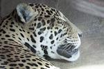

# Image resize in dotNet: from JPG to JPG
*21-12-2023*

Status: Work in progress  

## Intro

For the new [Team Xerbutri](https://github.com/TeamXerbutri) website, the guys asked me to improve the imagery.

That is a bit of a broad question.

So, I set of with resizing, what sizes are used on web these days? Also the resizing process takes a lot of time, and was done in old programs, batch processing the stuff in Jasc and saving the images multiple times as jpg, degrading the picture quality. Time for some modernization and automization of this process.

My Question:  
Can I resize images with a dotNet package? If so, what is the best package to use?

## *Rapid fire thoughts*

Maui only for embedded resources :-(  

Which packages in 2023?
- System.Drawing
- ImageSharp
- Magick.Net
- SkiaSharp
- MagicScaler

Others:
[Image resizer](https://discoverdot.net/projects/image-resizer)
[ImageProcessor](https://github.com/JimBobSquarePants/ImageProcessor) is dead, and this is a wrapper around system.drawing anyways. Became ImageSharp

## Test and BC

- .NET 6
- Windows 11
- JPG -> save as 75% quality JPG

## Decision makers

For your decision making process:

| Package                                                                |                                                                               License | Published | Version | Downloads |
|------------------------------------------------------------------------|--------------------------------------------------------------------------------------:|----------:|--------:|----------:|
| [System.Drawing](https://www.nuget.org/packages/System.Drawing.Common) |                                                                                   MIT |   11-2023 |   6.0.0 |  1124.1 M |
| [ImageSharp](https://github.com/SixLabors/ImageSharp)                  | [Six Labors split](https://www.nuget.org/packages/SixLabors.ImageSharp/3.1.1/license) |   12-2023 |   3.1.1 |    77.6 M |
| [Magick.Net](https://github.com/dlemstra/Magick.NET)                   |                                                                            Apache 2.0 |   12-2023 |  13.5.0 |    15.0 M |
| [MagicScaler](https://www.nuget.org/packages/PhotoSauce.MagicScaler)   |                                                                                   MIT |   10-2023 |  0.14.0 |     0.7 M |
| [SkiaSharp](https://github.com/mono/SkiaSharp)                         |                                                                                   MIT |    9-2023 |  2.88.6 |    69.1 M |
| [FreeImage](https://github.com/LordBenjamin/FreeImage.Standard)        |                           [Free Image](https://freeimage.sourceforge.io/license.html) |    6-2019 |   4.3.8 |    0.07 M |
| [ImageFlow](https://github.com/imazen/imageflow-dotnet)                |                                                            AGPL >=3.0 or Apache >=2.0 |    9-2023 |  0.10.2 |     0.3 M |

I added the license information for your managers if you want to use this software in company code. I find managers to often dislike (or forbid) copyleft-type licenses.  

Most of the packages are in full support or development, except Free Image which has not been updated for a while. System.Drawing and Skiasharp are Microsoft backed packages. This could be an advantage in terms of support.

MagicScaler and ImageFlow are still on the zero version, which might indicate there is no official production version yet.  

System.Drawing.Common is the most popular with 1124 million downloads!! ImageSharp comes second, closely followed by SkiaSharp. A far fourth is Magick.NET. MagicScaler and ImageFlow are promising packages, but they are not that popular. I only included FreeImage because it was in the previous test by [Bertrand Le Roy](https://devblogs.microsoft.com/dotnet/net-core-image-processing/) 

## Results in numbers

The results of this test

### Speed

| Package        |       Mean |      Error |    StdDev | Ratio |
|----------------|-----------:|-----------:|----------:|------:|
| System.Drawing | 309.024 ms |  4.0873 ms | 1.0615 ms | 1.000 |
| ImageSharp     |  98.459 ms |  3.8549 ms | 1.0011 ms | 0.319 |
| Magick.Net     | 350.393 ms | 10.8063 ms | 2.8064 ms | 1.134 |
| MagicScaler    |  57.191 ms |  2.4320 ms | 0.6316 ms | 0.185 |
| SkiaSharp      | 114.386 ms |  4.3097 ms | 1.1192 ms | 0.370 |
| FreeImage      | 206.092 ms | 12.7027 ms | 3.2988 ms | 0.667 |
| ImageFlow      |   1.457 ms |  0.3499 ms | 0.0541 ms | 0.005 |

*Legends*  
- Mean        : Arithmetic mean of all measurements
- Error       : Half of 99.9% confidence interval
- StdDev      : Standard deviation of all measurements
- Ratio       : Mean of the ratio distribution 
- 1 ms        : 1 Millisecond (0.001 sec)

Wow! What did the guys at imageFlow do? It is fast as lightning!!

Since 2017:
ImageSharp became way faster.
All others except system.drawing became a little faster as far as can be compared.

### Memory usage

Allocated memory and garbage collection

For your machine this does not matter, but having functions or other stuff in the cloud where you pay (or simply crash on memory overload), this is the allocated memory usage.

| Package        |      Gen0 |      Gen1 |      Gen2 |  Allocated | Alloc Ratio |
|----------------|----------:|----------:|----------:|-----------:|------------:|
| System.Drawing |         - |         - |         - |   52.63 KB |        1.00 |
| ImageSharp     |         - |         - |         - | 1323.22 KB |       25.14 |
| Magick.Net     |         - |         - |         - |    60.5 KB |        1.15 |
| MagicScaler    |         - |         - |         - |   151.2 KB |        2.87 |
| SkiaSharp      |         - |         - |         - |   94.03 KB |        1.79 |
| FreeImage      | 6000.0000 | 6000.0000 | 6000.0000 |  101.64 KB |        1.93 |
| ImageFlow      |   48.8281 |   43.9453 |   40.0391 |  262.71 KB |        4.99 |

*Legends*  
- Gen0        : GC Generation 0 collects per 1000 operations
- Gen1        : GC Generation 1 collects per 1000 operations
- Gen2        : GC Generation 2 collects per 1000 operations
- Allocated   : Allocated memory per single operation (managed only, inclusive, 1KB = 1024B)
- Alloc Ratio : Allocated memory ratio distribution

### File size

| Package        |   Size |  
|----------------|-------:|
| System.Drawing | 6,3 KB |
| ImageSharp     | 6,7 KB |
| Magick.Net     | 6,7 KB |
| MagicScaler    | 6,7 KB |
| SkiaSharp      | 4,0 Kb |
| FreeImage      | 5,3 KB |
| ImageFlow      | 4,0 KB |

Size is average size on disk 

## Quality

Subjective

| Package        |                                                                                                               |  
|----------------|--------------------------------------------------------------------------------------------------------------:|
| System.Drawing |  |
| ImageSharp     |             |
| Magick.Net     |                |
| MagicScaler    |          |
| SkiaSharp      |                |
| FreeImage      |                |
| ImageFlow      |                |

| Package        |                                                                                                               |  
|----------------|--------------------------------------------------------------------------------------------------------------:|
| System.Drawing |  |
| ImageSharp     |             |
| Magick.Net     |                |
| MagicScaler    |          |
| SkiaSharp      |                |
| FreeImage      |                |
| ImageFlow      |                |

| Package        |                                                                                                               |  
|----------------|--------------------------------------------------------------------------------------------------------------:|
| System.Drawing |  |
| ImageSharp     |             |
| Magick.Net     |                |
| MagicScaler    |          |
| SkiaSharp      |                |
| FreeImage      |                |
| ImageFlow      |                |

| Package |                                                                                                System.Drawing |                                                                                         ImageSharp |                                                                                      Magick.Net |                                                                                           MagicScaler |                                                                                       SkiaSharp |                                                                                       FreeImage |                                                                                       ImageFlow |
|--------:|--------------------------------------------------------------------------------------------------------------:|---------------------------------------------------------------------------------------------------:|------------------------------------------------------------------------------------------------:|------------------------------------------------------------------------------------------------------:|------------------------------------------------------------------------------------------------:|------------------------------------------------------------------------------------------------:|------------------------------------------------------------------------------------------------:|
|       1 |  |  |  |  |  |  |  |
|       2 |  |  |  |  |  |  |  |
|       3 |  |  |  |  |  |  |  |
|       4 |  |  |  |  |  |  |  |
|       5 |  |  |  |  |  |  |  |
|       6 |  |  |  |  |  |  |  |
|       7 |  |  |  |  |  |  |  |
|       8 |  |  |  |  |  |  |  |
|       9 |  |  |  |  |  |  |  |
|      10 |  |  |  |  |  |  |  |
|      11 |  |  |  |  |  |  |  |
|      12 |  |  |  |  |  |  |  |

Best quality in this test:

System.Drawing
ImageSharp
MagicScaler

Good:
ImageFlow, bit blurry

SkiaSharp is blurry and colors are off
FreeImage colors are off
Magick.NET colors are off

Differences: skiaSharp became worse on update

## Remarks

Remarks on the results:

First of all: Who does this?
I mean: If you like images, who is going to turn a jpeg into a jpeg, because you are destroying the image, right?
You would more likely save it as a PNG, or as a Webp image file. More about that in an upcoming blog!

You could set required output, like file-size or quality and achieve different results. For example, there are complaints about the image quality by the SkiaSharp package, but on the github issues you will find tricks to improve image quality. The scope of this test was to have comparable input, and compare the output ogf the packages. I am not sure this is fair.

## Follow up

- The pictures should have a watermark  
- The supported formats should be JPEG (.jpg), WEBP (.webp) and Portable Network Graphics (.png)  
- A program that should ultimately have functionality comparable to [Easy Thumbnails](https://www.fookes.com/easy-thumbnails) (in use by the team these days):
  - Batch process to **scale down** to different sizes for web
  - Batch process to save as different picture formats
  - Batch process to add a watermark to all pictures except thumbnails
- The program should run on iOS and Windows. 

Following post: Image format support.

## Resources

Inspiration:  
[.NET Core Image Processing](https://devblogs.microsoft.com/dotnet/net-core-image-processing/)

Packages:  
[PhotoSauce](https://photosauce.net/)

