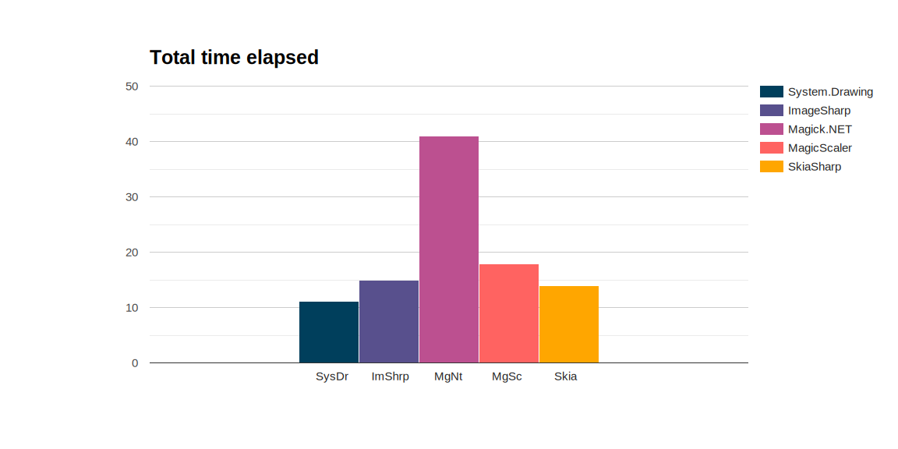
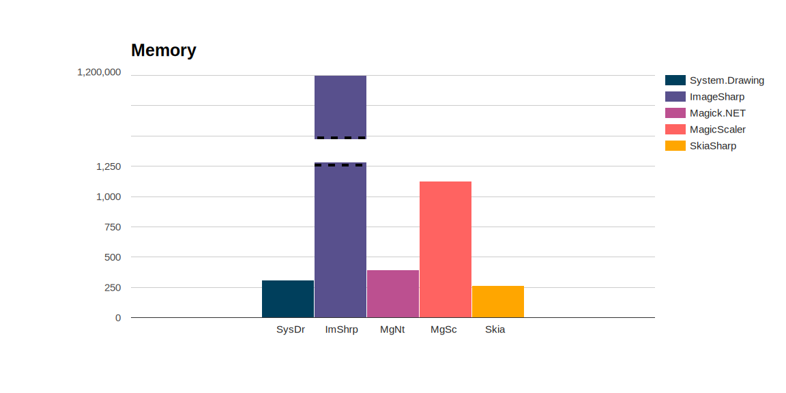
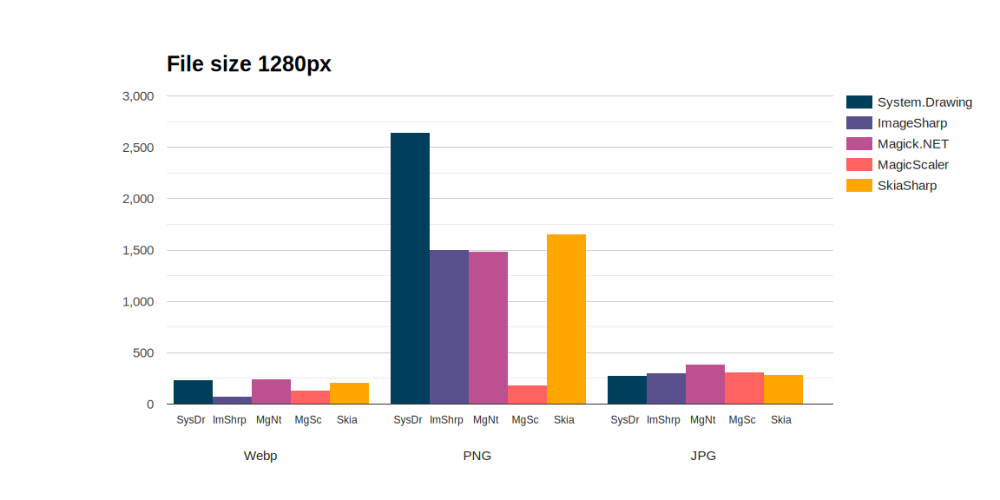
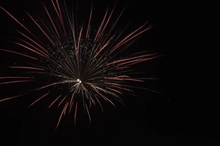
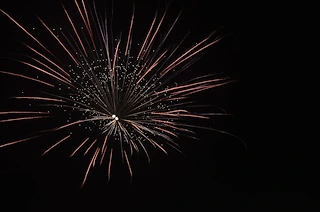
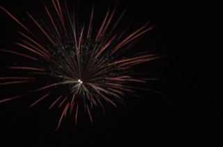
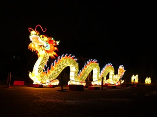
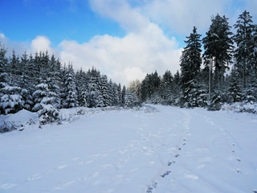
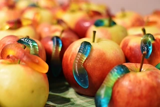

# Image resize in dotNet: from JPG to Webp on Windows OS

*16-1-2024*

## Introduction

For the new Xerbutri website, the guys want to know more about the Webp format. Should we support it on the new website?
What about the quality, how will our pictures look?

This test is a follow-up for the [Image Resize Test](./imageresize.md), and answers these follow-up questions:

- Which packages support JPEG (.jpg), WEBP (.webp) and Portable Network Graphics (.png)?
- Which packages will perform best in real-life scenario's with approx 40 pictures of 6Mb size?

I used about the same packages from the image resize test.

## Boundary conditions

Using 40 pictures would slow down the test and make it unusable. Instead it focuses on a more real-life scenario for
Team Xerbutri.  
This test uses 12 pictures which are more like the pictures I will expect the Xerbutri guys to upload to the
application.

This test:

- uses 12 pictures of approx 4500kB size each, ~6000 x ~4000 px
- resizes to 80px, 320px, 768px and 1280px
- benchmarking of load, resize and save operations
- using .NET 8
- using Windows 11 only
- saves the original jpeg as 95% quality jpeg format, png and webp in different sizes

### Packages summarized

A summary of the packages used in this table:

| Package                                                                |                                                                               License | Published | Version | Downloads |
|------------------------------------------------------------------------|--------------------------------------------------------------------------------------:|----------:|--------:|----------:|
| [System.Drawing](https://www.nuget.org/packages/System.Drawing.Common) |                                                                                   MIT |    1-2024 |   8.0.1 |  1161.2 M |
| [ImageSharp](https://github.com/SixLabors/ImageSharp)                  | [Six Labors split](https://www.nuget.org/packages/SixLabors.ImageSharp/3.1.1/license) |    1-2024 |   3.1.2 |    80.5 M |
| [Magick.Net](https://github.com/dlemstra/Magick.NET)                   |                                                                            Apache 2.0 |   12-2023 |  13.5.0 |    15.5 M |
| [MagicScaler](https://www.nuget.org/packages/PhotoSauce.MagicScaler)   |                                                                                   MIT |   10-2023 |  0.14.0 |     0.7 M |
| [SkiaSharp](https://github.com/mono/SkiaSharp)                         |                                                                                   MIT |    1-2024 |  2.88.7 |    72.3 M |
| [ImageFlow](https://github.com/imazen/imageflow-dotnet)                |                                                                tri or bi-license AGPL |    9-2023 |  0.10.2 |     0.6 M |

Read about the resize and implementation details in the [previous test](./imageresize.md).  
ImageFlow did not produce usable output. I think I made a mistake somewhere, but sadly I have no time to look into this
bug.

### Format support

The packages claim to support lots of formats. And in fact have no support whatsoever. I only checked for Webp, PNG and
Jpg.

| Package                                                                | JPG | PNG | Webp |                                    Remarks |
|------------------------------------------------------------------------|-----|-----|------|-------------------------------------------:|
| [System.Drawing](https://www.nuget.org/packages/System.Drawing.Common) | y   | y   | *    | depends on GDI+ codecs installed and found |
| [ImageSharp](https://github.com/SixLabors/ImageSharp)                  | y   | y   | y    |                   GIF and ~3 other formats |
| [Magick.Net](https://github.com/dlemstra/Magick.NET)                   | y   | y   | y    |                 GIF and ~100 other formats |
| [MagicScaler](https://www.nuget.org/packages/PhotoSauce.MagicScaler)   | y   | y   | y    |            depends on WIC codecs installed |     
| [SkiaSharp](https://github.com/mono/SkiaSharp)                         | y   | y   | y    |      none of the 9 other supported formats |      
| [ImageFlow](https://github.com/imazen/imageflow-dotnet)                | y   | y   | y    |                 no other formats supported |     

For System.Drawing.Common, Webp has support on windows GDI+ since windows 10- 1089. However, it depends on the codec
installed on your system. If no codec can be found, System.Drawing will silently fall back to PNG.

In this test the silent fallback was observed. In order to have a WebP format in test. system.drawing uses
the [SkiaSharp.Views.Desktop.Common](https://www.nuget.org/packages/SkiaSharp.Views.Desktop.Common/) package for
encoding and saving the image as WebP.

According to
a [Xamarin blog by Microsoft](https://learn.microsoft.com/en-us/xamarin/xamarin-forms/user-interface/graphics/skiasharp/bitmaps/saving#exploring-the-image-formats),
SkiaSharp only supports three of the 12 image formats. This test does not check that claim.

## Results in numbers

The results of this test in numbers: the time elapsed to produce the pictures, the memory used and the resulting
filesize.

### Time elapsed

The time elapsed is just an indication, as run on my laptop. So please just focus on the ratio.

This is not optimized at this moment. For Magick.Net three separate processes are spun up to handle the images. I can
imagine this takes time (and memory), making it three times slower.
I just spent max 15 minutes per package to do this stuff, I had no more time to spare. Please let me know if you want to
improve, or have ideas.

#### Conclusion

Measuring decreases the performance of the code. All of these packages are fast enough, with Magick.NET being twice
slower.

### Memory usage

The next picture shows allocated memory usage. For your machine this does not matter, as generally speaking the amount
of memory on your own machine is sufficient. If you have functions or other an app in the cloud where you pay for
memory (or simply crash on memory overload), this is very relevant.

Cloning in ImageSharp uses insane amount of memory, 4000 times more than other the apps.  
Those pictures are 55 Mb in total. Why is it using 1200Mb? In the last test it used 1.2Mb of the 3Mb on disk. If it
scales exponentially, what will happen in a real scenario when the guys process 30-40 photo's of about 200-500Mb at
once? At least 12Gb?

For the other apps: I did not spent any time optimising. It does save the one picture in 4 sizes and three formats,
producing 12 files out of one picture. I think performance is great, considering most apps use <500 kB of allocated
memory for handling 55 Mb of pictures.

#### Conclusion

ImageSharp is very heavy on the memory. The other packages perform very nice indeed.

### File size

Webp produces the smallest image file size possible. However, there are huge differences between the packages. I read
the System.Drawing GDI codec makes no effort to produce small files, and that certainly shows. It is possible to use
other codecs, but this has an effect on quality as well.  
ImageSharp has the smallest filesize, followed by MagicScaler. The other packages are equals.

The MagicScaler PNG is not a mistake. It really is that small.
The System.Drawing produces big PNG files. Again, this shows the encoder settings can make a big difference. In this
test the defaults are sed, but there is room for improvement.

In the land of JPEG everything is about the same. SkiaSharp and System.Drawing produce small images. ImageSharp and
MagicScaler a bit bigger. Magick.NET has the largest files.

## Quality

Quality is again a subjective matter. Let's look to some of the pictures produced and see the differences.

### Fireworks

So, fireworks. What is happening?

| Package        | JPG                                                                                                                           | PNG                                                                                                                           | Webp                                                                                                                              |
|----------------|-------------------------------------------------------------------------------------------------------------------------------|-------------------------------------------------------------------------------------------------------------------------------|-----------------------------------------------------------------------------------------------------------------------------------|
| System.Drawing |  |  |  |
| ImageSharp     |             |             |                |
| Magick.Net     |                |                |                   |
| MagicScaler    |          |          |             |
| SkiaSharp      |                |                |                   |

It is the same thing happening in every picture produced, but here the differences are perfectly visible.

System.Drawing: In the JPG there is this weird white-versus-color thing going on. I miss the red! The PNG is a bit
better. The skia-saved webp is much too white!  
ImageSharp: The PNG has much more red compared to the JPG (due to chroma-subsampling). The PNG looks like the original.
For Webp the colors seem off.  
Magick.NET: The JPG is perfect, spot on. The PNG as well. The Webp: Where have the colors gone?  
MagicScaler is crisp and very white.   
SkiaSharp: I like their take on the fireworks, because it is a bit less sharp, but it has a lot of blurring and edge
halo going along. I need to fix this with the trick on Github.

### The dragon

Let's look at another high contrast example, because the Team Xerbutri guys love those.

| Package        | JPG                                                                                                                  | PNG                                                                                                                  | Webp                                                                                                                     |
|----------------|----------------------------------------------------------------------------------------------------------------------|----------------------------------------------------------------------------------------------------------------------|--------------------------------------------------------------------------------------------------------------------------|
| System.Drawing |  |  |  |
| ImageSharp     |             |             |                |
| Magick.Net     |                |                |                   |
| MagicScaler    |          |          |             |
| SkiaSharp      |                |                |                   |

This is nitpicking, but for the picture-perfectionists:

System.Drawing: The color-loss is a lot less visible, but pay close attention to the nostril-things of the dragon. This
is a chroma-subsampling effect. The black is not black, the jpg encoding is ruining it. There are several MCU-blocks
visible. The PNG looks fine, like the original. The Webp has some red-loss, but looks fine in details.

ImageSharp: Same as System.Drawing, but a tiny bit better. The PNG looks like the original. I really hate the loss of
the red in webp. The red of the dragon was really red and cool, but it is almost flat here. Also do you see how blurry
it is. The rope is gone!

Magick.NET: What happened in the JPEG? The fireworks was fine, and now... The red is gone. It is sharper than ImageSharp
and System.Drawing. The PNG looks great. The Webp: Where did the colors go?

Magicscaler: Compare this to the fireworks. There is a bit more white, but all three dragon pictures look okay to me.
The JPG has its encoding problems with the mcu-edges being visible like all of the jpgs.

SkiaSharp: It is just not sharp. Blurry all over the place. On the positive side, the JPG black does not look too bad in
this case.

### How about them apples?

In a more normal scenario, above 320px the extreme whiteness of MagicScaler is present only in snowy pictures:

| Package |                                                                                                        System.Drawing | MagicScaler                                                                                                               FileSize (KB |  
|---------|----------------------------------------------------------------------------------------------------------------------:|---------------------------------------------------------------------------------------------------------------------------------------:|
|         |  |                        |

In the MagicScaler the trees show more snow. This effect occurs in high contrast scenario's, these often occur in the
pictures taken by Team Xerbutri.

Looking at pictures with lower contrast, MagicScaler just looks very good, I mean, look at these file sizes! Who doesn't
want this quality at this file size?

| Package              |                                                                                                                                    | FileSize (KB) |  
|----------------------|-----------------------------------------------------------------------------------------------------------------------------------:|--------------:|
| System.Drawing (PNG) |  |           198 |
| MagicScaler (PNG)    |       |            27 |
| MagicScaler (Webp)   |    |            18 |
| MagicScaler (JPG)    |      |            28 |
| System.Drawing (JPG) |  |            25 |
| SkiaSharp (PNG)      |                  |           112 |

#### Conclusion regarding picture quality

In the 80 px thumbnail category, the whites from MagicScaler are strong in all of the pictures. Skia looks blurry.
System.Drawing, ImageSharp and Magick.Net are fine.

The 320px category is where the differences between packages (or their settings) stand out the strongest. I reviewed the
picture quality with stars. Five stars meaning best quality, one star being bad. This very objective manner show the
differences between the packages for the different compression formats:

| Package        |  JPG |   PNG | Webp |
|----------------|-----:|------:|-----:|
| System.Drawing |  *** | ***** |  *** |
| ImageSharp     | **** |   *** |    * |
| Magick.Net     |  *** | ***** |   ** |
| MagicScaler    | **** | ***** | **** |
| SkiaSharp      |    * |     * |    * |

System.Drawing has great PNG quality, but JPEG and WebP are just fine. There are some edge halo effects in the JPG and
blurriness in the Webp.

ImageSharp produces good JPG, but the PNG quality is mediocre. The Webp images are all blurry, which is weird.

Magick.NET produces a very good PNG quality image, where some JPGs are a bit blurry and have some edge halo, the Webp is
even more blurry. Just a tiny bit more, compared to System.Drawing.

MagicScaler produces great pictures in all sizes with regard to sharpness. The them apples WebP picture is just as good
as the original, which at this filesize is real magic! The downside of this package is the whitening in high contrast
scenarios. I'd like to know if there is a fix for that.

SkiaSharp is just blurry overall.

## Conclusion

System.Drawing is the fastest package. Memory usage is great. However, the produced PNG files are so large they are
useless. Also the WebP file size is more than twice the size of an ImageSharp or MagicScaler Webp. Quality-wise the
PNG's are great, but JPG and Webp are overall just fine. File support is a ***. You may think certain files are
supported, while silently falling back on... That is not nice.

ImageSharp is very heavy on the memory. It was in the last test, and it still is in this test. Locally it just nicely
warms the room, but I cannot use it on a server, it will crash or cost me dearly. Filesize is normal for JPG and PNG,
and low for Webp.

Magick.NET is the slowest package, producing good quality PNG pictures, but lagging behind in the JPG and Webp quality.
I love its fireworks JPG and it has great real file support, so if that is your thing, go for it!

MagicScaler is far too white to be a winner for the Team Xerbutri scenario. This is especially a big deal in the 80px
wide thumbnails and high contrast scenarios. MagicScaler has the best quality for PNG size. I will need to investigate
the white problem and what settings are used. The total time elapsed is a bit slow, and it uses more memory than
System.Drawing, but it is still light weight. And I did not optimize these packages, please remember that. The file
sizes it produces are magically small! The quality it produces is high.

SkiaSharp, sorry you guys. I need to redo this test one time with the sharpness tweak, because, unless you have bad
sight, it just won't do.

Learned a lot out of this benchmark. But there is no winner. The overall performance of System.Drawing is fine. What I
want is MagicScaler quality and filesizes, without the whitening in high contrast situations.

### Follow-up

- Why is MagicScaler so white? Is it a contrast setting?
- Can I tune picture quality? Pictures with high contrast and vibrant color ask for a different approach in settings.
- Can I improve on the file size, by chosing another codec, or other settings?
- Imageflow produced broken files, maybe due to a mistake in the code. I do not expect it to be a winner, and the
  implementation is not my style.
- For SkiaSharp I found this sharp-filter on github. Implementing this will take some time, and I just don't know if it
  is worth the effort. I still think this is a package to go for if you want full platform support. Will it improve the
  results that much?

## Resources

Inspiration:  
[.NET Core Image Processing](https://devblogs.microsoft.com/dotnet/net-core-image-processing/)

About jpeg:  
[JPEG definitive guide](https://www.thewebmaster.com/jpeg-definitive-guide/)

Packages:

[Webp in System.Drawing](https://learn.microsoft.com/en-us/dotnet/api/system.drawing.imaging.imageformat.webp?view=dotnet-plat-ext-8.0)  
[Issues in System.Drawing with Webp on GitHub](https://github.com/dotnet/runtime/issues/70418)    
[Issues in System.Drawing with Webp on StackOverflow](https://stackoverflow.com/questions/75988248/save-a-webp-file-with-system-drawing-imaging-generates-a-big-file-size-or-encode)  
[Image formats in System.Drawing](https://learn.microsoft.com/en-us/dotnet/api/system.drawing.imaging.imageformat?view=dotnet-plat-ext-8.0)

[Image formats in ImageSharp](https://docs.sixlabors.com/articles/imagesharp/imageformats.html)

[Image formats in Magick.Net](https://imagemagick.org/script/formats.php)

[MagicScaler](https://photosauce.net/blog/post/introducing-magicscaler)

[Image formats in SkiaSharp Xamarin](https://learn.microsoft.com/en-us/xamarin/xamarin-forms/user-interface/graphics/skiasharp/bitmaps/saving)  
[Image formats in SkiaSharp](https://learn.microsoft.com/en-us/dotnet/api/skiasharp.skencodedimageformat?view=skiasharp-2.88)

[Image formats in ImageFlow](https://docs.imageflow.io/json/encode.html)