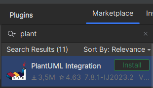
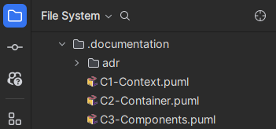
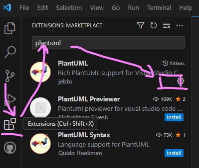
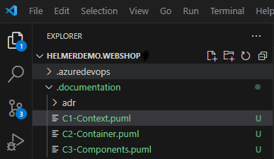
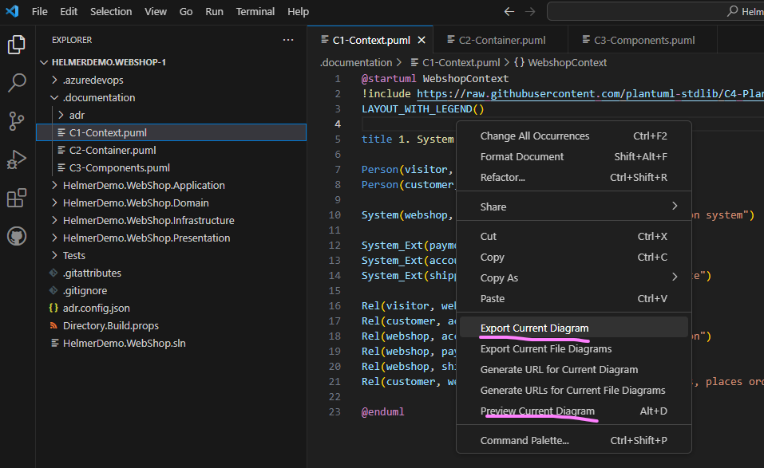

# How to generate architecture diagrams
*8-9-2023 - updated 3-4-2024*

In this article I will explain how to generate an architectural diagram.

The [UML language](https://plantuml.com) is used to code the diagrams.
The C4 model is used to structure the architectural diagrams.

## What is the C4 model?

Aside from being a car manufactured by Citroën, it is a graphical notation technique for modelling the architecture of
systems.

- C1 level: (System) Context diagram. It shows the system in scope and relationship with other systems and its users;
- C2 level: Container diagrams. It shows the decomposed system and the relation between its containers. A container
  represents an application or data store;
- C3 level: Component diagrams. It shows the interrelated components in a container;
- C4 level: Code diagrams;

The C2 level has nothing to do with Docker containers. It is just a term coined by simon Brown to describe something
holding components, but not being the system. With a C, because otherwise it won't
The C4 level is highly debated, for its usefulness and for its zoom-level. You can generate code diagrams from your IDE.
Simon says: I do not recommend level 4.

Simon also says: Don't do Simon says, so do not see this as a dogma. These are guidelines for architecture diagrams.

### Zoom level

The first three models are clearly related, and I always see this as a zoom level.  


So, from the Context-level on C1, where you see the system and the world in lives in, you zoom into the system going to
the C2 container level. Suppose you want to kno more about a certain application, you zoom into level 3, the components
level.

## How to generate a C4-model-style diagram with Rider


  

As I (re)discovered [Rider from Jetbrains](https://www.jetbrains.com/rider/), I also noticed it is very very easy to generate C4 models. I will take you through how to generate the C4 models, and other PlantUml diagrams by using the [PlantUml integration plugin by Vojtěch Krása](https://plugins.jetbrains.com/plugin/7017-plantuml-integration).
This is so much easier and faster compared to the Visual Studio code-way I will discuss later.

### Setup and installation

For Rider, the setup and installation is easy and very fast.  

Just go to the plugins:  


Go to Marketplace and search for the PlantUml integration plugin:  
  
Click Install and restart Rider. You are ready to go.

### Generate an architecture diagram

For most of my repo's I store the architecture diagrams in the ".documentation" folder:  


This is where I store the plantUml files. For example look at the [WebShopDemo GitHub documentation](https://github.com/HelmerDenDekker/HelmerDemo.WebShop/tree/develop/.documentation).

#### Code the architecture diagram

First code a new architecture diagram. Coding the diagram is easy.

In the first line you start with "@startuml" to start the uml, in the last line, end it with... @enduml.  
In the second line I include the Context model settings from the plantuml-stdlib.  
In the third line I include the legend.  
In the fifth line I enter a title for this model.

Next you can go crazy with whatever you want. In this example I show:
- Person, with the arguments variableName (this will be the name of the variable, you can use later in the relations)
- System, like Person.
- Rel, which shows the relation between Person and System

```bash
@startuml ModelName
!include https://raw.githubusercontent.com/plantuml-stdlib/C4-PlantUML/master/C4_Context.puml
LAYOUT_WITH_LEGEND()

title ModelTitle

Person(variablenameperson, "NamePerson", "Description person")

System(variablenamesystem, "NameSystem", "Description system")

Rel(variablenameperson, variablenamesystem, "Description relation")

@enduml
```

#### Example and generation

You clone [the webshop demo repository](https://github.com/HelmerDenDekker/HelmerDemo.WebShop), and open the C1Context.puml in the .documentation folder. 

##### Preview

If you open the file, the plugin will generate the diagram:
Compared to Visual Studio Code, this is a lot faster. For rider there is no need to install Java, or open a menu to preview the diagram.


##### Menu

If you click on the generated diagram with the right mouse button -the one at the right if you did not switch them around-, you will get the menu:  


Here you can "export" (save) the diagram to a file, or copy it to the clipboard.

### Conclusion on rider

Generating the C4 models with Rider is very easy and fast. I recommend using Rider for generating the C4 models.

## How to generate a C4-model-style diagram with VS Code

  

I will take you through how to generate the C4 models with Visual Studio Code, context level, container level and component level, step by step.

### Setup and installation

Step by step installation procedure:

#### 1. Use Visual Studio Code

I generate the C4 models using [Microsoft Visual Studio Code](https://code.visualstudio.com/). I hope you have this IDE installed. As an alternative you can also use the [online server](https://www.plantuml.com/), but that has its limitations.  


I will use VS code throughout this how to.

#### 2. Install Java

The first step is to install JAVA. I had to go through the agony of visiting the plantUML website, sorry guys, but every
time I get so nervous of how it looks and behaves. with the picture popping up, every time I go AAAAAARRGH!  
Sorry. I am calm now.

Install Java (if you do not have it installed already): [Java download link](https://www.java.com/en/download/)

Please check the license terms.

#### 3. Visual Studio Code Extensions

In VS Code, install the plantUml extension.



- Click on Extensions icon
- Type plantuml in the search box
- Click on the install button (I already installed it, should be where the pink box is)

Now you are ready to go!

### Generate an architecture diagram in VS code

For most of my repo's I store the architecture diagrams in the ".documentation" folder:  


This is where I store the plantUml files. For example look at
the [WebShopDemo GitHub documentation](https://github.com/HelmerDenDekker/HelmerDemo.WebShop/tree/develop/.documentation).

#### Code the architecture diagram

First code a new architecture diagram. Coding the diagram is easy.

In the first line you start with "@startuml" to start the uml, in the last line, end it with... @enduml.  
In the second line I include the Context model settings from the plantuml-stdlib.  
In the third line I include the legend.  
In the fifth line I enter a title for this model.

Next you can go crazy with whatever you want. In this example I show:

- Person, with the arguments variableName (this will be the name of the variable, you can use later in the relations)
- System, like Person.
- Rel, which shows the relation between Person and System

```bash
@startuml ModelName
!include https://raw.githubusercontent.com/plantuml-stdlib/C4-PlantUML/master/C4_Context.puml
LAYOUT_WITH_LEGEND()

title ModelTitle

Person(variablenameperson, "NamePerson", "Description person")

System(variablenamesystem, "NameSystem", "Description system")

Rel(variablenameperson, variablenamesystem, "Description relation")

@enduml
```

#### Example and generation

You clone [the webshop demo repository](https://github.com/HelmerDenDekker/HelmerDemo.WebShop), and open the C1Context.puml in the .documentation folder. If you click on in with the right mouse button -the one at the right if you did not switch them around-, you will get the menu:  


##### Preview

You can preview the context model by clicking preview current diagram.


As you can see (I sketched lots of arrows):

- The legend shows at the bottom
- The title shows at the top
- The Customer person shows as a Person icon
- The Webshop system shows as a System icon
- The Account service shows as an external system
- The relation shows as a black arrow with description.

##### Export

You can export the file, next you get to choose the filetype. The file is exported to an out folder by default.

Here is an example of a generated diagram:


## How to generate a C4 model from Visual Studio

 

Mind this: Simon says: Do not use the C4 model (code = documentation on this level).

How do you generate a C4-diagram?

1. Open the folder of your solution in Visual Studio or Visual Studio Code
2. Create a folder named <code>.classdiagrams</code> inside this folder.
3. Open the Terminal (VS upper menu, Terminal --> New Terminal) or Package Manager (VSC: upper menu Tools --> Nuget
   Package Manager --> Package Manager Console)
4. In the terminal window execute.

```bat
puml-gen [local-path-to-repo]\[project] [local-path-to-repo]\[project]\.classdiagramms -dir -excludePaths bin,obj,Properties
```

You can add any folders you want to exclude in the end.

Inside the <code>.classdiagrams</code> folder you will find all the separate class diagrams and a combined class
diagram.

## Conclusion

It is that easy. Feel free to look around in my diagrams to see how I created the Containers and Components
diagrams: [WebShopDemo GitHub documentation](https://github.com/HelmerDenDekker/HelmerDemo.WebShop/tree/develop/.documentation).

## Resources

[PlantUML Quick start Guide](https://plantuml.com/starting)  
[C4 model](https://c4model.com/)
[GitHub C4 model and plantuml](https://github.com/plantuml-stdlib/C4-PlantUML)


