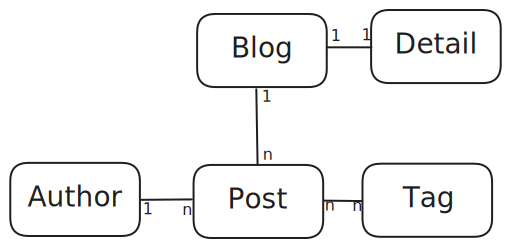
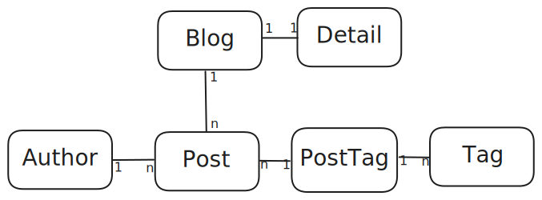

# How to EF Core: Code first approach

*23-4-2024*

Status: Work in progress
Type of post: Guide

## *Rapid fire thoughts*

Resource on how to use EF core, because I already did this a couple of times

## *Outline*

Code first approach

Setup Entities

Setup DbContext

Setup Migrations

# A code-first approach

Infrastructure project for persistence. Choose your persistence strategy based on your needs.
- Active record pattern if you need an entry-kind of app
- Data mapper pattern if you have a complex domain model

## Step 1: Create the entities

At first I will guide you through some database design:

### Domain model

As a software engineer, you will talk to some people (haha) or at least think about the problem you want to solve. We call this the domain. The domain can be modeled.

For example: We want to create an app for managing multiple blogs. The domain model can look like this:  
(DDD-guys will probably shoot me now).



Let's say that there is some specific logic about the BlogDetails that should be in a separate class "Detail".

Let's look at this as software developer.
The Blog class can look like this:

```csharp
public class Blog
{
	public int BlogId { get; set; }
	public string Url { get; set; }
	public Detail BlogDetail { get; set; }
	public List<Post> Posts { get; set; }
}
```

The blog has one detail and multiple posts.

The Post class can look like this:

```csharp
public class Post
{
	public int PostId { get; set; }
	public string Title { get; set; }
	public string Content { get; set; }
	public Author Author { get; set; }
	public List<Tag> Tags { get; set; }
}
```

A post has one author (in this example) and can have multiple tags.

The Tag class can look like this:

```csharp
public class Tag
{
	public int TagId { get; set; }
	public string Name { get; set; }
	public List<Post> Posts { get; set; }
}
```
A tag can be used in multiple posts.

### Relational model

A database engineer would look at this using the relational model:
- The relation between Blog and Detail is one-to-one.
- The relation between Blog and Posts is one-to-many. One blog has a list of posts.
- The relation between Tags and Posts is many-to-many.

He will probably tell you, your database is not normalized.  
Usually you will think: You are not normalized!  

Fact.

He will tell you the database structure will have to look like this:



Because many to many relations are difficult for databases, or something along those lines.
Or maybe even worse (for you), a structure that merges blog and detail. 

### EF core 8 to the rescue!

Sigh. I want to have a simple app (simple is better). I want the active record pattern and use my domain models directly in my persistence.

This is where EF8 comes in with a rescue plan. You can use the domain models directly in your persistence layer! EF Core 8 will handle the many-to-many relations for you.

You do need to model the relations in your domain model in order for entity framework to understand them.

I need the Posts to know about the Blogs. Just add the BlogId as foreign key to the post, and add the Blog as navigation property.

```csharp
public class Post
{
	public int PostId { get; set; }
	public string Title { get; set; }
	public string Content { get; set; }
	public Author Author { get; set; }
	// Navigation properties
	public int BlogId { get; set; } // Foreign key
	public Blog Blog { get; set; }
	public List<Tag> Tags { get; set; }
}
```

The Author class can look like this:

```csharp
public class Author
{
	public int AuthorId { get; set; }
	public string Name { get; set; }
	// Navigation properties
	public List<Post> Posts { get; set; }
}
```
The Tag class is fine as it is. The BlogDetail class can look like this:

```csharp
public class Detail
{
	public int DetailId { get; set; }
	public string Description { get; set; }
	// Navigation properties
	public int BlogId { get; set; } // Foreign key
	public Blog Blog { get; set; }
}
```

We have the entities!! Next step is to create the DbContext.

## Step 2: Create the DbContext

Choose your ~~poison~~ database provider. Postgres, mssql, mysql, sqlite, cosmosdb, etc. NEVER use in-memory: this is for very specific testing cases only!! You should not even use it for testing. Forget I even mentioned it. 

Tip:  
Install Microsoft.EntityFrameworkCore.SqlServer package

Create a class that inherits from DbContext. This class will be the bridge between your entities and the database.
In its simplest form with hard coded connection string it looks like this:

```csharp
public BlogDbContext : DbContext{
	public DbSet<Blog> Blogs { get; set; }
	public DbSet<Post> Posts { get; set; }
	public DbSet<Tag> Tags { get; set; }
	public DbSet<Author> Authors { get; set; }
	public DbSet<Detail> Details { get; set; }

	protected override void OnConfiguring(DbContextOptionsBuilder optionsBuilder)
	{
		optionsBuilder.UseSqlServer("Server=(localdb)\\mssqllocaldb;Database=BlogDatabase;Trusted_Connection=True;");
	}
}
```

In a real world scenario you use a connection string from a configuration file.

## Step 3: The Setup project

The "Setup project", or migration helper is an idea by Helmer den Dekker and Patrick Keller: We want the setup of the database to be separate from the other projects.
The idea is to run the Setup project and it sets up the database and migrations for you.

### How to?

Add a console project to your solution. This project will set the database up, seed it and take care of migrations.  
See the [HelmerDemo.WebShopDemo.Infrastructure.Setup](https://github.com/HelmerDenDekker/HelmerDemo.WebShopDemo/tree/develop/src/Services/WSD.Catalog.Infrastructure.Setup) for implementation details.  
// TODO step by step explanation

#### Infrastructure EF migrations

In Visual Studio, go to the Package Manager console and select the WSD.Catalog.Infrastructure project

##### Create migration

```bash
Add-Migration YOURNAME -StartupProject Demo.Blog.Infrastructure.Setup
```

##### Update database without specific migration

```bash
Update-Database -StartupProject Demo.Blog.Infrastructure.Setup
```

##### Update database with specific migration

```bash
Update-Database -StartupProject Demo.Blog.Infrastructure.Setup
```

##### Create SQL scripts from migration a to migration b

```bash
Script-Migration -From -To -Context BlogDbContext -StartupProject Demo.Blog.Infrastructure.Setup -Output "Demo.Blog.Infrastructure\Scripts\<ScriptName>.sql"
```

## Resources


### Relationships

[Microsoft Learn - Introduction to relationships](https://learn.microsoft.com/en-us/ef/core/modeling/relationships)  
[Microsoft Learn - Relationship One-to-one](https://learn.microsoft.com/en-us/ef/core/modeling/relationships/one-to-one)  
[Microsoft Learn - Relationship One-to-many](https://learn.microsoft.com/en-us/ef/core/modeling/relationships/one-to-many)  
[Microsoft Learn - Relationship Many-to-many](https://learn.microsoft.com/en-us/ef/core/modeling/relationships/one-to-many)  

### Migrations

[EF Core Add Migration](https://www.learnentityframeworkcore.com/migrations/add-migration)

### Normalization
[Normalization](https://www.databasestar.com/database-normalization/)