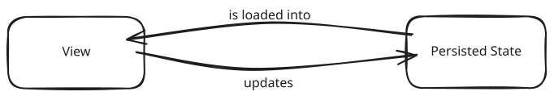
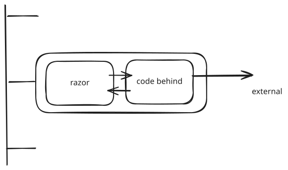
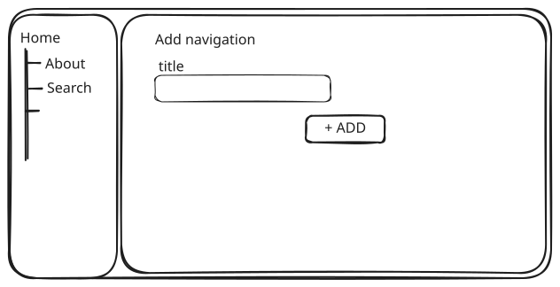
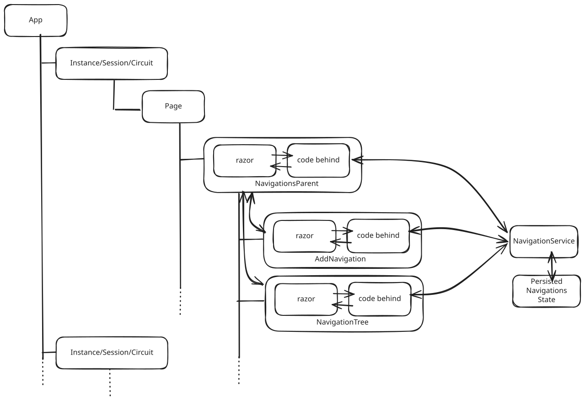
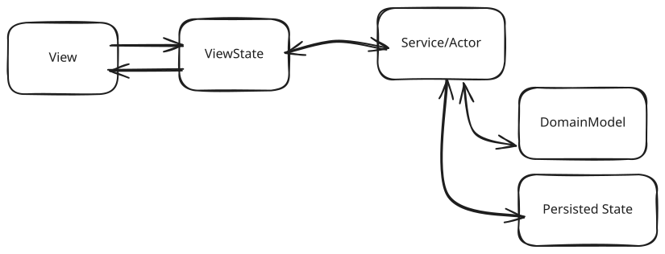
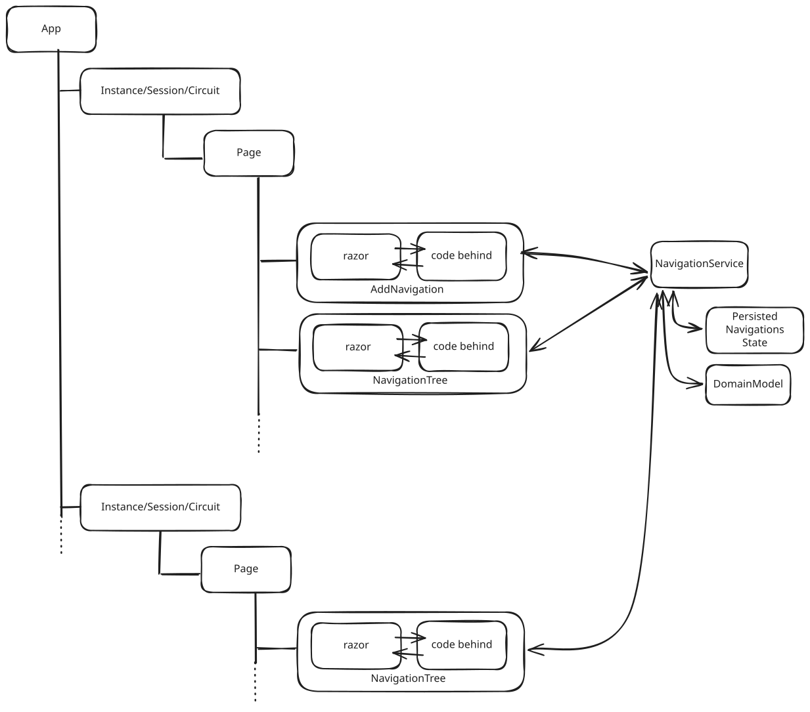
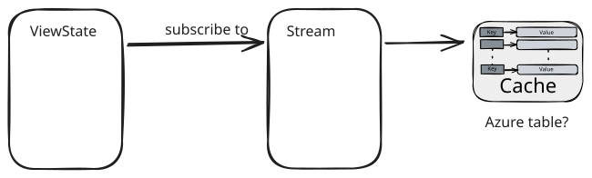

# Blazor app architecture

*9-2-2026*

Status: Work in progress Idea  
Type of post: Guide

## *Rapid fire thoughts*

[//]: # ( ToDo: Write!)
This is about Blazor-Server.

## Problem statement

Blazor has a component-based architecture.  
Each component manages its own state.  

My problem is that the .razor files get big and messy in a hurry.  

I have four questions:
- How to organize a (more complex) Blazor app.
- How to share state between components.
- How to share state between tabs.
- How and where to persist state, and how often.

## Problem statement thoughts.

Blazor gives you a lot of freedom. My problem is encountering different kinds of logic, in different (but scattered!) places in blazor apps.

In the past, when using html-api style apps, state was simple.  
For the backend, the state was simply persisted in the database.  
For the FrontEnd the state was in the DOM / browser.

You could just work anywhere, and the state of the application and the state of the database were decoupled.

The business logic was in the backend, and some logic like validation needed to be replicated to the frontEnd.
We had clear pattern for that.  
There was a clear idea of what was a view, and what was state.  
With Blazor these boundaries are fading. The view and the state are mixed together in the same component, sometimes acompanied by logic.

I think the components-idea is great. But this is about the view, what used to be the frontend.   
I think there is still a place for FrontEnd logic to be separated from Backend-logic for complexer applications.

### More generic

Basically, applications are a solution for synchronizing between the view and a persistence layer.  
The view has a state, and after the user submits, this state is persisted and can be retrieved.

### What about Blazor?

Blazor(Server) keeps Sessions in a circuit. This is a connection between a browser tab and the server. This session is NOT persisted (unless maybe with newer Blazor??).

The View is the instance of the app that the user sees in the browser tab, with the razor page and its components. The rendered component-tree.

Let's focus on one component.
Suppose it has a .razor file, with a .razor.cs backend.
The .razor part is about the View: the markup and the behaviour. If a user clicks a button, you bind to this method in the code-behind.
The .razor.cs code behind file is a bit like the ViewModel, it contains the properties and methods that are bound to the view. However, it also contains the state of the component (Model-part), and sometimes also the orchestration.

What makes this difficult to follow? 
- The component lives in a tree, and has a relation to other components. It can be manipulated or rerendered.
- The lifecycle is bound to the circuit, or the lifetime of the component. It is tricky to use external services here the way you were used to in old-school MVC-apps.

### Fading boundaries

In a Blazor application, these boundaries are fading. The old way of thinking about DI and services is no longer valid. A service is scoped to the lifetime of the component.
In Blazor-server it is all mixed together in a huge cement-mixer, and scattered all over the place. Sometimes keep-it-simple is best,but what patterns to use here?

### Typical Blazor architecture

Suppose you have an application with a navigation tree on the left in a partial view, and a view to add something to the navigation tree.

In Blazor, I think I would create something like this:

So, there is a NavigationsParent component, and whenever a new navigation item is added, that part of the tree will be rerendered.
Or we can cascade the navigation state from the parent, actually keeping the state in the parent. But we maybe also want to keep state in the components itself, because that is where it actually lives. so if I just want to read, this will be fine.
How about I want to edit?

I will need copies of the state, right? And if there is a change, when I save it, rerender.

Never mind the rant.  
My point is, that Blazor takes care of a ot of those thing for you, without you having to implement anything. Nice, isn't it?

Yes and no...

Pros:
+ Framework code is far away.
+ This is perfectly vertically sliced. The logic and orchestration is close together, with minimal distance.

Cons:
- Logic is hard to follow.
- Cascading and rerendering is expensive.

This starts falling apart as soon as it becomes more complex. 

Is there a better way to do this?

### What about MVVM

In MAUI apps, the MVVM model is used a lot. However, in MAUI apps, there is one instance of the app, whereas in Blazor we can have multiple.

In MVVM (Model-View-ViewModel):
- the View is the abstraction of the User Interface (UI). The logic is about how to present the data to the user.
- the Model contains the business logic and the data/properties. It is the abstraction of the business logic.
- the ViewModel binds the View and the Model together. It exposes the data and commands from the Model to the View.

So, in Blazor terms, the .razor is the View, and the code-behind is the Model. Blazor itself binds the View and the Model, so the ViewModel is actually hidden.

Sorry.

It is a bit more complicated, because the ViewModel often acts as an orchestrator as well. Because you might want to persist data somewhere. That is why in Web there is MVC, Model-View-Controller. The Controller has the orchestration-logic, the view is about the view and the Model contains the business logic.

To make matters even more complicated: In the MAUI app, the state is persisted in memory. There is always one state. 

Compare this to Blazor, where the state exists in your browser on the one side (on the HTML-page), and this is synchronised with a (unreliable?) signalR connection through websockets with the server.

Browser-State => SignalR => Server-State.

The server-state is the state of the circuit, and it is not persisted. If the circuit is lost, the state will be lost  at a certain point ON THE SERVER. It still very much may exist in the browser. We don't know!

We do not have these problems in a MAUI app, because the app does not lose connection with your computer, whereas in Blazor, your phone may lose connection with the internet.

In the MVC-Web-apps, these things used to be decoupled. So, you download a form. The state in the browser is the local state. And you upload the local state to a computer, IF there is a connection. Your browser and the code on your machine take care of the rest.

Blazor does not have a fallback like that. It is a single point of failure. If the circuit is lost, the state is lost. Unless you implement a mechanism to persist the state somewhere.

So, MVVM is not a good fit for Blazor-Server for the web. Blazor itself already implements the MVVM-pattern.

### What about an actor or service pattern?

I like the MAUI idea of pushing the state further back.
How can I make this work for Blazor?  

What about Model-View-Service?

Split the logic into three parts:
- Model: the state and the business logic.
- View: the razor component, with the view logic.
- Service: the orchestration logic, like persisting the state somewhere.

I keep the hidden binding of the View to the Model intact. I have no problems with that.

#### Help! What about the model?
The problem is how to think about the Model.

The view represents the state in the browser, right?
It needs to be bound to properties. 
The properties needed for the view can differ from the properties needed for the DomainModel.

It would be logical to have a View, and a ViewState.
There needs to be some kind of service orchestrating loading/initialization of the ViewState model, and keeping the DomainModel up to date.

It tackles the problems of:
- Decoupling of the ViewState in Blazor with the DomainModel
- Possibility of old-fashioned decoupled updating of the domain model and persisting a single state
- Possibility of shared state.

If this NavigationService has an Update subscription, I can just subscribe components to it, and rerender any components that subscribed, even outside the session if I want to.

Or just create a UserSession, and update all tabs for this user concerning this page.

Pros:
- Testable
- 

Cons:
- increased distance
- 

### What about event sourcing?

Aren't we just working against the architecture here? What about Event sourcing? Make the most of signalR?

The idea here is that any change (even keystroke) can be an event, and we can add it to a stream.
This stream of changes is the source of truth.

With a publish-subscribe mechanism it is easy to keep track, or scroll through the changes.

Pros:
- No more lost data. every keystroke is saved
- Audit trail included (who, when, where)
- Version picking
- No more merging.

Cons:
- rather heavy for memory, to have constant rerendering of all instances.
- Architecture is very different.

### What about MVU

Another pattern is the Model-view-update.

The MVU pattern structures the application in three main components:
- Model
- View
- Update

The model is an immutable record that holds the state.
The view is the UI-part.
The update is the logic that updates the model.

Another important part are the Messages. These are "commands" that are sent from the view to the update, to trigger an update of the model.

 
I like this idea.
It is all about composition. You add behaviour to the Update function.
Any cross cutting concerns require new functions. 
I did not yet implement this in a more complex solution. But I think this could spin out of control, when there are lots of cross-cutting concerns.

## Resources

[MVU in MAUI](https://en.ittrip.xyz/c-sharp/mvu-pattern-dotnet-maui)  
[MVU vs MVVM in Blazor](https://amarozka.dev/mvvm-vs-mvu-blazor-enterprise-state-pattern/)

## Back to the problem.

1. Problem of shared state in multiple tabs. => UserSession. == MessageBox example.
2. Problem of shared state in multiple components. This can be easily dealt with using ViewModels and INotifyPropertyChanged. This wil rerender the full component. I am not sure this is the best solution.
3. Problem of testability can be handled by using IViewModel interfaces. This decouples view from viewmodel.
4. Problem of logic scattered all over the place. MVVM 
5. Problem of persistence. Blazor-Server depends on websocket connections.

I have a problem with the combination of those.
Since I cannot rely on blazor because of 5 (no persistence), I need a mechanism to persist a shared state somewhere.
And retrieve it when the circuit is lost.

There is no need for View-ViewModel binding in Blazor, it already does that.
Blazor does not have a way to share state accross tabs.
Suppose I want this shared state, AND I want notification.
Back.
1. I want shared state between the different tabs AND notifications between these tabs.
2. I want shared state between the different components AND notifications between these components.

This is simple!
Store - manage - update.
Have subscriptions.

- UserSessionStore. (state persistence) Lifetime: singleton
- UserViewModel (bound to the view, should handle state changes both ways) Lifetime: circuit
- UserSessionState (the state of the user session, with all the properties and domain logic) Lifetime: custom
- UserSessionStoreManager => handles expiration of sessions etc. Lifetime: singleton

This is all I need? 
Suppose Logout => multiple tabs. I change the state, INotifyPropertyChanged will kick in for all other viewmodels and change the state.

## Order!

How do we bring back order, so we can have a clear architecture, and a clear way of thinking about the state and the logic?

- Service, has the Application logic (like persist, connection to external API etc)
- Actor/Binder (binds the State to the View and the Service)
- View (the razor component in Blazor, with only view logic)
- State (the model in MVVM)

Decouple views from the domain.

We have to discuss the lifetimes.  
Or, where do these things live?

- The view follows the circuit, which is fine.
- The actor can follow the circuit. It is responsible for binding the state to the view, and for calling the service.
- The service needs to be transient.
- The state may need to outlive the circuit.

The state is a bit difficult, and use-case dependent.

Suppose I have the navigation tree, I want that state to be shared. It should live as long as it is needed.
If I simply add a new navigation-link, once it is added to the tree (persisted), there is no need for this "state" to keep existing.

What about idempotency? 

> Idempotency means that multiple identical requests should have the same effect as a single request.

- Solution

## *Outline*

## Resources
[ASP.NET Core Blazor Best Practices — Architecture and Performance Optimization](https://blog.devart.com/asp-net-core-blazor-best-practices-architecture-and-performance-optimization.html)
[ASP.NET Core Blazor rendering performance best practices](https://learn.microsoft.com/en-us/aspnet/core/blazor/performance/rendering?view=aspnetcore-10.0)