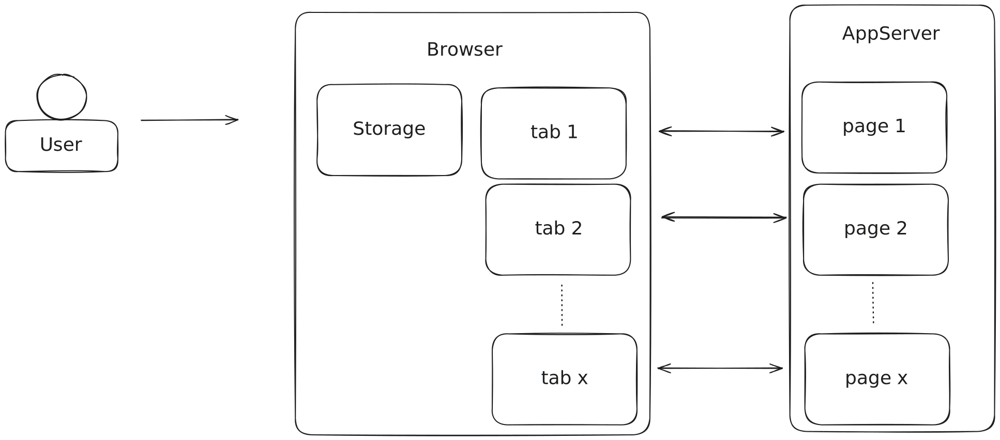
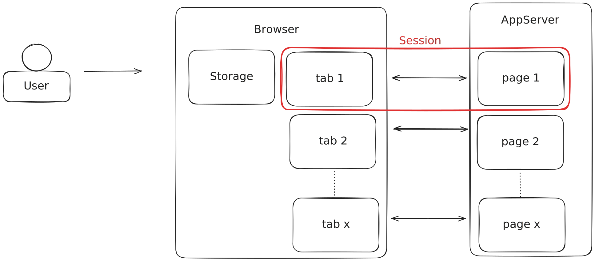
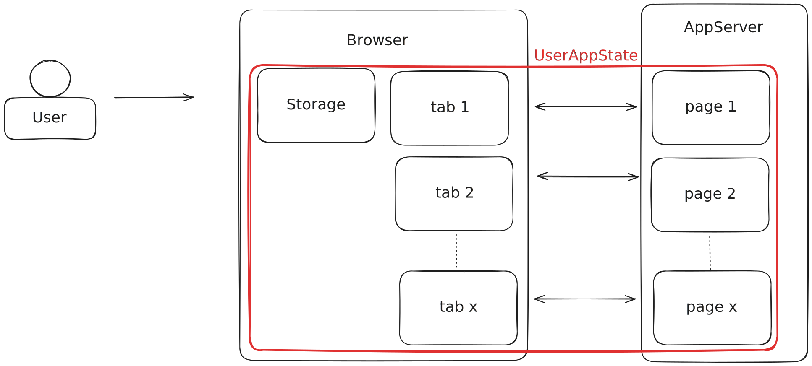

# Share state across multiple tabs in Blazor-Server

*23-12-2024*

_Status: Work in progress_  
_Type of post: Guide_

## *Rapid fire thoughts*

About: application state in a .NET 8 Blazor Web App using Interactive Server RenderMode

### Problem

I have to keep state in this application. I want to share state between different pages/tabs in the browser per user. 

What do you mean?  
Blazor Server is already a stateful framework. It keeps state between the users session and the server.

Any session in the browser has a connection to the server.  
In words:
- Any changes in page 1 propagate to tab 1, and not to tab 2.
- Any changes in tab 1 propagate to page 1 and not to page 2.

This is a great idea, but there are a few challenges:
- This session-state of pages is not stored by default. If the user refreshes the page, the state is lost.
- If the connection between page and tab is lost, the user cannot do anything (semi-opaque vail of death). If the connection comes back, state is lost.

### Boundary conditions

Think hard about your boundary conditions. 

#### User session state

Do you only want to store the state of the user session?

[//]: # ( ToDo: Interesting to solve the per session problem.)
This has the narrowest scope. My idea is to store and fetch the state from ProtectedSessionStorage. Having it in the pages, means it is reinitialized every time Blazor will load. You could fetch from SessionStorage every time, but that is slow.

#### Full application state per user

Or do you want to store the state of the full application per user?

This is described by Carl Franklin in [Managing Application State in .NET 8 Blazor Web Apps](https://github.com/carlfranklin/appstateserver).
However, in this example, the pages no longer have individual state. There is one boss: AppState, taking care of the states of all of the pages. For example, it a user opened ten counter pages in different tabs, all of these values are the same.
- Get shared variables for all pages and components.
- Stores state in the browsers localStorage

#### My problem domain

It is an app in which it is possible to have multiple users editing the same data on one page.
- If two users are working on the same data, they should see each other's changes (RealTime).
- A user can work in one browser-tab, with the same data the same user works on in another browser-tab, changes should be in sync.
- If a user refreshes the page, the state should be restored.
- If the server goes down, the state should be restored.
- The data cannot be stored in LocalStorage reliably, because it is too big and changes too fast.
- Web sockets do not guarantee delivery, I need some kind of streaming of the changes.

More abstract:
- Variables need to persist between page navigations.
- Variables can be shared between certain pages:
  - Pages with the same contentId are shared.

Out of scope:
- Offline use of the application. When connection is lost, so be it.
- Merging the data is out of scope for this blog.

## Solution proposition

Store - manage - update.
Have subscriptions.

- UserSessionStore. (state persistence) Lifetime: singleton
- UserViewModel (bound to the view, should handle state changes both ways) Lifetime: circuit
- UserSessionState (the state of the user session, with all the properties and domain logic) Lifetime: custom
- UserSessionStoreManager => handles expiration of sessions etc. Lifetime: singleton

This is all I need?
Suppose Logout => multiple tabs. I change the state, INotifyPropertyChanged will kick in for all other viewmodels and change the state.

Do this with the MessageBox in the Demo application.

[//]: # ( ToDo: Write!)

## *Outline*

## Resources

[Managing Application State in .NET 8 Blazor Web Apps](https://github.com/carlfranklin/appstateserver)