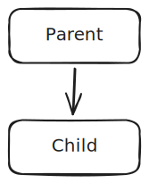
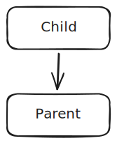
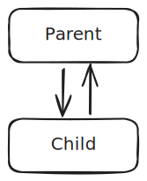
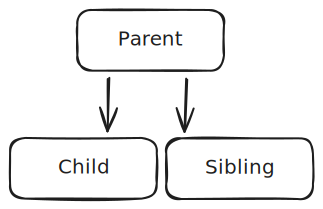

# How to manage state in Blazor?

*18-2-2026*

_Status: {Work in progress} {Idea}_  
_Type of post: {Opinion piece} {Guide} {Resource}_

## *Rapid fire thoughts*

[//]: # ( ToDo: Write!)

## Problem statement

I am experiencing difficulties with state management in Blazor.
- Rendering borders
- How to effectively and efficiently share state between components?
- There are so many rerenders 
- I have a problem with organization.

How to synchronize state?
How to persist state?
How to manage the complexity?

## Boundary conditions

Only Blazor-Server.

## Description of the problem

Blazor has a component-based architecture.  
Each component manages its own state.

However, the problem is that often state is shared.
And this is where Blazor becomes inefficient.

### Parent to child communication

The basic pattern for parent to child is to use cascading parameters. This is a way to pass data down the component tree (from parent to child).

One-way from parent to child:



Parent:

```csharp
<Child Date="@Date"/>
@code {
    // The date from the parent, which is passed to the child.
    private DateTime? Date { get; set; }
}
```

Child:

```csharp
<p>Date: @Date.ToString()</p>

@code {
    [Parameter]
    public DateTime? Date { get; set; }
}
```


Child components can inform parents by raising an event or invoking a callback. These are ways to pass data up the component tree.  

One-way from child to parent:  


Child:
```csharp
<input type="date" value="@Date?.ToString()" @onchange="OnDateChanged" />


@code {
    private DateTime? Date { get; set; }
    
    [Parameter]
    public EventCallback<DateTime?> DateChanged { get; set; }
    
    private async Task OnDateChanged(ChangeEventArgs e)
    {
        if (DateTime.TryParse(e.Value?.ToString(), out var newDate))
        {
            Date = newDate;
            await DateChanged.InvokeAsync(Date);
        }
    }
}
```

Parent:
```csharp
<Child DateChanged="OnChildDateChanged" />
    
@code {
    private DateTime? Date { get; set; }
    
    private void OnChildDateChanged(DateTime? newDate)
    {
        Date = newDate;
    }
}
```


## Chained bind (two way bind).

Using @bind, we can do two-way databinding between razor and the server. If the view changes, the value in the component changes. If the component changes, the view changes.



The other way to do binding is value="@value" and @onchange="OnValueChanged(e)".

Child:
```csharp

<input type="date" value="@Date?.ToString()" @onchange="OnDateChanged" />
    
@code  {    
    // This is the state, and comes from the parent.
    [Parameter]
    public DateTime? Date { get; set; }
    
    //In order for the binding to work, the name has to be [PropertyName]Changed, and the type has to be EventCallback<T>.
    [Parameter]
    public EventCallback<DateTime?> DateChanged { get; set; }
    
    private async Task OnDateChanged(ChangeEventArgs e)
    {
        if (DateTime.TryParse(e.Value?.ToString(), out var newDate))
        {
            Date = newDate;
            await DateChanged.InvokeAsync(Date);
        }
    }
}
    
```

You can call this from the parent as chained bind:

```csharp
<Child @bind-Date="@Date" />
@code {
    private DateTime? Date { get; set; }
}
```

### What about siblings?

There should be no direct state sharing between siblings.  
The basic reflex is to move the state up to the parent, and then pass it down to the siblings. This is a way to share state between siblings.
This way we can use the Parent-Child relation again.



### What about shared state?

Suppose we have lots of components, and all these components share a button class that needs have the same styling class.

```csharp
<button class="@ButtonClass">Click me</button>
@code {
    private string ButtonClass => "btn-primary";
}
```

I want all buttons in all children with buttons to have the same class. I can use cascading parameters, and cascade them through all components. Which is nasty, because some components do not have the button, right?  

No problem, Blazor has a solution for this, it is called cascading values. You can cascade a value from a parent component, and then any child component can consume it without having to pass it through every level of the component tree.

```csharp
<CascadingValue Value="ButtonClass">
    <Child1 />
    <Child2 />
</CascadingValue>
```

In the child components, you can consume the cascading value like this:

```csharp
<button class="@btnClass">Click me</button>
@code {
    [CascadingParameter]
    private string btnClass { get; set; }
}
```

NB!!! The name does NOT have to be the same as the name of the cascading value! Blazor will match the type of the cascading value to the type of the cascading parameter.

Problem?? If I have two cascading values of the same type, how does Blazor know which one to use?
It will use the closest one in the component tree.

So if I have this:

```csharp
<CascadingValue Value="ButtonClass">
    <Child1 />
    <CascadingValue Value="UserName">
        <Child2 />
    </CascadingValue>
</CascadingValue>
```

Child1 will get the ButtonClass value, and Child2 will get the UserName value. 
```csharp
<button class="@btnClass">Click me</button>
@code {
    [CascadingParameter]
    private string btnClass { get; set; }
}
```

So change will get very hard very fast in complex applications!  
Suppose you want to add a Cascading value somewhere, you may change a lot within this application without you knowing. All button classes in the children below Child1 may have the username value.
Blazor to the rescue again: We can create complex types, OR give the Cascading values a name.

#### More problems:
- Cannot cross rendering borders (until dotnet 10/11)
- Performance: Change tracking => Changing the state through a sibling, will cause the parent to rerender, and all of its children. You can turn change-tracking off, but what if the state changes?
- Scalability: As the application grows, the state management becomes more complex and difficult to manage. It is not easy to maintain and debug.
- It lacks modularity and has tight coupling. It is difficult to manage when the application becomes large. It is not CUPID, and not even SOLID.
- Testability: It is difficult to test the components in isolation, because they are tightly coupled with the state management.

In my opinion, the view should be about handling user input and rendering.

## @ref to the rescue!

Suppose I want to call a method in a child component from the parent component. I can use @ref to get a reference to the child component.

```csharp
<Child @ref="childComponentRef" /> 
<button @onclick="Revert">Revert</button>
    
@code {
    private Child childComponentRef;
    
    // We want the parent to be able to revert the date, but we cocked up the architecture massively! No probs! Blazor to the rescue
    private void Revert()
    {
        childComponent.RevertDate();
    }
}
```

```csharp
public class Child : ComponentBase
{
    public DateTime? Date { get; set; }
    private DateTime? lastDate;
        
    public async Task RevertDate()
    {
        if(Date != lastDate)
        {
            Date = lastDate;
            await DateChanged.InvokeAsync(Date);
        }
    }
```

Changing the properties of the referenced component will mess up the rerendering mechanism of Blazor.

Most of the time, this is an architectural smell, because revert should be the responsibility of the parent, and not the child.

Suppose, I want functionality to revert ALL dates in ALL DateField children with a single button (or like RemoveAll, something like that) from the parent, that might be a use-case for @ref.  
Storing the origDate is a responsibility of the child, and in the parent I can create some method to revert all children by creating a list of references, and call all the children's revert methods.

Use with care!  

[Pluralsight @ref](https://app.pluralsight.com/ilx/video-courses/95113fe5-803a-4c0e-be10-f7ebd3e70829/ca983c4e-0f00-4285-bfa0-210b3ab80499/f30c7b52-3468-464f-8547-47ca57f46531)

## Solution - Service-repository pattern?

The [Pluralsight course](https://app.pluralsight.com/library/courses/asp-dot-net-core-blazor-managing-state) gets into an old Service-pattern solution. Service-Repository. It grows in code-complexity and the distance becomes large.
It does not really solve the problem of state management. There is just a singleton state in the whole app. So ALL users get to see the same state.

Using a database is slow. As state should be a "source of truth", it should be faster. But what if it is distributed?

## Problem: Concurrent Editing.
Propagate change with SignalR? 
Merge logic implementations.
And what if you are offline? Blazor will not work? Or use local storage, and sync-back when online again.


## *Outline*

## Resources
