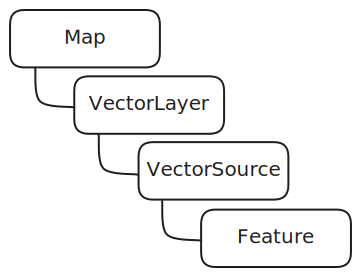

# OpenLayers Styles

*17-6-2024*

Status: Work in progress  
Type of post: Guide/Resource

## *Rapid fire thoughts*

Write down how you did

## *Outline*

### Context

In the first part I started out with a centered map.
In the second part, I added a vector layer with a KML file.

This part concerns the styling of Open Layers, more in general.

### Styles

### Changing the style

Changing the style is really easy, but I could not find an easy description of how to do that.

It was a bit like throwing pizza at the wall, and see what sticks.

What I think this does, is when all features loaded, it sets the type to icon, which is the style I want to use.

```js{4}
const vector = new VectorLayer({
	source: new VectorSource({
		url: 'assets/kml/2012-02-10.kml',
		format: new KML({
		})
	}),
	style: function (feature) {
			return styles[feature.get('type')];}
});
map.addLayer(vector);

vector.getSource().on('featuresloadend', function (event) {
		event.features.forEach(function (feature) {
			feature.set('type', 'icon');
		});
	});
```
Which overrides all the styles in the kml and shows the icon style.

### Styles explained

If you want to know about styles, the concept changed a bit from version 3 to 9.

As what CSS is for an HTML page, styles are for OpenLayers.

You define the styles in an object, and then you can use them in the style function.

```js{4}
const styles = {};

// define style for type icon
styles['icon'] = new Style({
	image: new Icon({
		anchor: [0.5, 46],
		anchorXUnits: 'fraction',
		anchorYUnits: 'pixels',
		opacity: 0.75,
		src: 'assets/icon.png'
	})
});
```

So styles is a sort of dictionary (in the code-kind of way), where you define a key (icon in the example above) and add a value ( new Style).

#### The styling function

Use the styling function to return the style for the feature you want to style.

```js{4}
const styleFunction = function (feature) {
  return styles['icon'];
};
```

#### The map, Layers, features and types

So, before you style, you need to know about features.



The concept op Open Layers, is that you have a map, which contains layers. You can add as many layers to the map as you want.
The layers have a source of information, in the case of a vector layer, this is a vector source.

The vector source contains the features, which are the objects you can style.

A [feature](https://openlayers.org/en/latest/apidoc/module-ol_Feature-Feature.html) is some object you can individually show on the map, like a point, a line or polygon.

The style function needs a key from the feature to apply the style to that.

By defining a feature, you can set the style for that feature.

```js{4}
const marker = new Feature({
	type: 'markerfeature',
	geometry: new Point([6, 51.7])
})

marker.setStyle(styles['icon']);

```

Or, you can use any of the properties of the Feature object to set the style.

```js{4}
const marker = new Feature({
	type: 'icon',
	geometry: new Point([6, 51.7])
})

const styleFunction = function (feature) {
  return styles[feature.get('type')];
};
```

In the example above the style is set to the feature type.

But you could also use the geometry type to set the style, as in the GeoJson example. 

### Adding it all together.

The map must know the layer, its source and its styling function to set the style.

```js{4}
const raster = new TileLayer({
	source: new OSM({
		projection: 'EPSG:4326'
	})
});

const map = new Map({
	target: 'map',
	layers: [raster],
	view: new View({
		projection: 'EPSG:3857',
		center: [6, 51.7],
		zoom: 8
	}),
});
	
const marker = new Feature({
	type: 'icon',
	geometry: new Point([6, 51.7])
})

const styles = {
	'icon': new Style({
		image: new Circle({
			radius: 7,
			fill: new Fill({color: 'rgba(255, 0, 0, 1)'}),
			stroke: new Stroke({
				color: 'rgba(255, 255, 255, 1)',
				width: 2,
			}),
		}),
	}),
}

const markerLayer = new VectorLayer({
	source: new VectorSource({
		features: [marker],
	}),
	style: function (feature) {
		return styles[feature.get('type')];
	},
});
map.addLayer(markerLayer);
```

### Use multiple styles on one feature

You can use multiple styles on one feature, by using an array of styles.

```js{4}
const styles = {
	'icon': [
		new Style({
			image: new Circle({
				radius: 7,
				fill: new Fill({color: 'rgba(255, 0, 0, 1)'}),
				stroke: new Stroke({
					color: 'rgba(255, 255, 255, 1)',
					width: 2,
				}),
			}),
		}),
		new Style({
			image: new Icon({
				anchor: [0.5, 46],
				anchorXUnits: 'fraction',
				anchorYUnits: 'pixels',
				opacity: 0.75,
				src: 'assets/icon.png'
			})
		})
	]
}
```


### Conclusion

Use the styling function to style the features on the map.


## Resources
[OpenLayers Style API](https://openlayers.org/en/latest/apidoc/module-ol_style_Style-Style.html#clone)
[GeoJson example](https://openlayers.org/en/latest/examples/geojson.html)