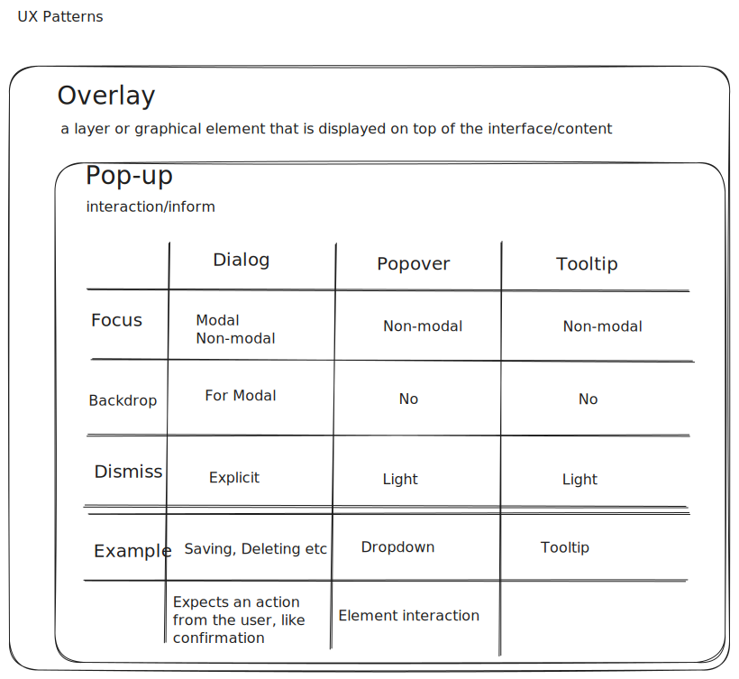

#  UX patterns: Overlay

*4-4-2024*

Status: Work in progress  
Type of post: Resource

## *Rapid fire thoughts*

I want to know more about Ux terms. These are personal notes

## *Outline*

## Overlay

Overlay: An overlay is a graphical user interface element that appears on top of the rest of the content on the screen. It is used to display additional information or to ask for user input. 

### Focus
Defines the way the other content on the page is shown. The focus can be modal or non-modal.

Modal: The overlay blocks user interaction with the rest of the page until the overlay is closed.
Non-modal: The overlay does not block the user from interacting with the rest of the page.

Backdrop: The background of the overlay that is used to make the overlay stand out from the rest of the content on the page. A page with backdrop has an opaque background and is used only for Modal. (Modal has backdrop)

### Dismiss
The way the overlay is closed.

Explicit: The overlay is explicitly closed with ESC, X or a button (cancel or close).
Light: The overlay is closed by clicking outside the overlay.

### Overlay types

There are different types of overlays based on their purpose.

#### Dialog

Use a dialog when you expect an action from the user. A dialog is a type of overlay that is used to display an important message and ask for user input.

An example is a confirmation dialog that asks the user to confirm an action, for example, deleting a file.

A dialog can be modal or non-modal.
Use modal dialogs that are required to be closed before the user can interact with the rest of the page.
Use non-modal dialogs if the user needs to interact with the rest of the page. For example when the user enters a new appointment in the agenda. In that case it is useful to be able to scroll through the agenda while the dialog is open.

#### Tooltip

A tooltip is a type of overlay that is used to display additional information about an element on the page. It is used to provide context and help the user understand the element better.
The tooltip is always non-modal and is closed by moving the mouse away from the element.

#### Popover

A popover is a type of overlay that is used to display additional information about an element on the page. It is used to provide context and help the user understand the element better.
The popover is always non-modal and is closed by clicking outside the popover.

#### Notification

A notification is a type of overlay that is used to display important messages to the user. It is used to inform the user about something that requires their attention. Notifications can be used to inform the user about new messages, updates, or errors.

#### Lightbox
A lightbox is an overlay that is used to display images or videos. It is used to show the media in a larger size and to provide a distraction-free viewing experience.

## Resources

outdraw.design on youtube  
[Popups, dialogs, popovers, and tooltips | UX Patterns #2](https://youtu.be/EWp65UQpB5g)  
[Outdraw academy](https://www.outdraw.academy/)  
