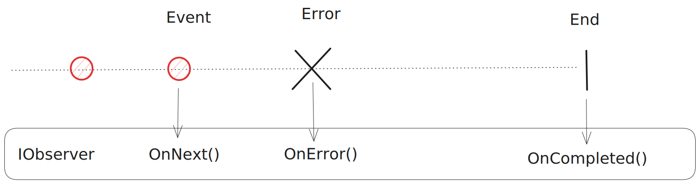
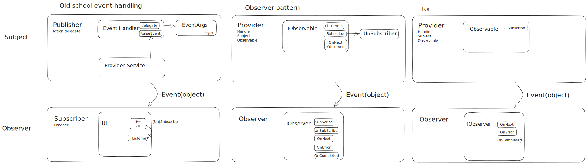

# Reactive programming

*24-4-2024*

_Status: {Work in progress} {Idea}_  
_Type of post: {Opinion piece} {Guide} {Resource}_

## *Rapid fire thoughts*

## *Outline*

## Reactive Programming

Reactive programming combines the Observer pattern with the Iterator pattern and Functional programming.

It is a programming paradigm oriented around data flows and propagation of change.

For example: Excel. If you update one cell, all cells dependent on this one cell are updated instantly.

## Marble diagram

Below the marble diagram explained.

---
## Academic answer

Let's talk patterns

### Observer pattern

The [observer pattern](https://en.wikipedia.org/wiki/Observer_pattern) is a behavioural design pattern in which an
object (subject) maintains a list of dependents (observers) and notifies them of any state changes.

It addresses the following problems:

- An object (subject) can notify multiple other objects (dependencies)
- Tight coupling in case of one-to-many dependencies between objects
- On state change of the subject object, an open-ended number of dependencies needs updating

The observer design describes a subject and an observer.

Plus:

- Loose coupling of subject and observer
- Single responsibility: Subject updates, observer reacts

Minus:

- Possible memory leak when implemented badly (lapsed listener) if the subject holds strong references to the observers,
  keeping them alive.

Here you see three implementations in dotNET.
The first one shows old school event handling with delegates, with a publisher and sunscriber. The Eventhandler has a
delegate (callback), and a service to raise (multiple) events.

The second shows the observer pattern as implemented in plain dotnet.
The third shows the Reactive extensions pattern.

#### delegates

Each event is treated separately.

- Using the delegates looks quite clumsy syntax-wise (+=).
- It is difficult to combine delegates or pass around them.
- The chaining and error handling is awkward (not as we are used to anymore... we are spoiled.)
- No history of events (no event sourcing)

#### Level up: Observer pattern

The Observer pattern is one level up, compared to the delegates.
There is an Observable subject, which has Subscribe and Unsubscribe methods, replacing the clumsy += and -=.
The observable has a list of observers registered to this observable, it can call its IObserver interface methods like
OnNext to push values out.

The Observer has a Subscribe and Unsubscribe method, and the OnNext, OnError and OnCompleted. This is much more clear
compared to eventhandling with delegates, where you could have created these yourself.
OnNext pushes the next value.
OnCompleted means it is ready.
OnError means an error occured.
With Subscribe and Unsubscribe the observer can register to an observable.

#### Another level up: Reactive Extensions

Build on top of the observer pattern are the reactive extensions. It is the same, but also very different.
Notice in the picture it does not look that different. It basically looks as a simplified layer on top of the observer
pattern.

It is more, but more about that later.

## Resources

