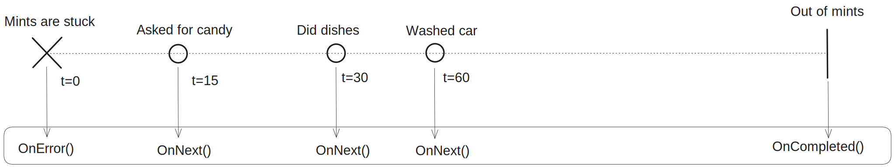

# What is reactive X?

*15-7-2024*

Status: Work in progress  
Type of post: Resource

## *Rapid fire thoughts*

My experience with Rx and why I like it:
- Filtering: It is easy to filter the data in the event in the subscription (functional programming style)
- Error handling: It is easy to handle errors in the subscription
- For me the pattern is easier to maintain, or spot, because a += or -= is quickly overseen. And you might forget to dispose these. It a hygiene thing.

The downside:
- Learning curve is steep! It is not easy to get into, I think the guys are on another level. Because there is a lot to it (functional AND reactive programming), and the push-pull thing. Also the problem space is complex. So it is difficult to come up with simple examples.
- The documentation (still) is not always clear to me.

## *Outline*

- What is Rx?
- When to use Rx?
- Why should I use ReactiveX instead of default event handling?

## What is ReactiveX?

For me the learning curve was steep. My problem space was complex, so I had to learn a lot of things at once. The state pattern, observer pattern, functional programming and ReactiveX.
Let me try to explain ReactiveX.

### ReactiveX, explained for pro's

Explained for pro's: ReactiveX is a combination of the Observer pattern, the Iterator pattern, and Functional programming.

|              | Pull                       | Push                       |
|--------------|----------------------------|----------------------------|
| One          | `object`                   | Callback                   |
| One - Async  | `Task<object>`             | Callback                   |
| Many         | `IEnumerable<object>`      | `IObservable<object>`      |
| Many - Async | `IAsyncEnumerable<object>` | `IAsyncObservable<object>` |

I was inspired by [Ian Griffiths](https://endjin.com/who-we-are/our-people/ian-griffiths/#blogs) diagram, and I extended
it. [IAsyncObservable is in preview](https://github.com/dotnet/reactive) at the time of writing.

Pull -> the consumer proactively looks for data changes (polling in case of events, or go to an API when I want the newest data.)  
Push -> the consumer receives a value whenever it is available  
Push-Pull -> the consumer receives a change notification as the push-part, and needs to pull the changes

### ReactiveX explained like I am five years old

Me: I want candy.  

Pull: I go to the cabinet, and take the candy.  
Push: My mom will bring me candy from the cabinet, whenever it is available.  
Push-Pull: I ask my mom for candy. She will let me know when I can go to the cabinet and take it myself.  

Pull: Advantage: I can make my own decisions on when to get candy. Disadvantage, if there is no candy, I have to go to the cabinet again. And again. And again.
Push: Advantage: No need to run to the cabinet all the time. Disadvantage: A dependency on my mom, which is complicated.

Me: I want many!?  

Pull: I can get a roll of mints. I can get them one by one myself.  
Push: I can ask my mom to give me one every time she seems fit.
Push-Pull: I can ask my mom to let me know when I can take one myself.

The "push" is the ReactiveX way of handling stuff.  

My mom can use ReactiveX to set up a scheme when to provide me with mints, and I can subscribe to that.
She can use a marble diagram to explain to me when I can expect a mint:

Whenever mints are stuck in the roll, and won't come out, she can tell me that, and I can decide what to do with that information. They call that OnError.  
As I ask for candy, mom can tell me when she is out of mints, so I can stop asking. They call that OnCompleted.  
Mom can also give me a mint when another event has taken place, like when I did the dishes of washed the car. I will get the next mint. They call that OnNext.  

That is how ReactiveX works.

## When to use ReactiveX?

As became clear from the example above,I can use ReactiveX for solving push, or push-pull problems.

I hear you say: So? We have like, events for that already, don't we?  

Yes. I like Rx better, it is a level-up from events.
- ReactiveX uses the observer pattern.

Explain it to me in code.

[//] # (ToDo - add code examples)

## Rx library 

Rx library consists of:

- Core: Flows, sequences and events, observables, observers and subjects
- Linq and extensions for filtering and querying
- Schedulers and concurrency

## Resources

[ReactiveX](https://reactivex.io/)  
[Reactice extensions for dotnet developers](https://learn.microsoft.com/en-us/shows/on-net/reactive-extensions-for-net-developers)  
[Reactive extensions for dotnet](https://github.com/dotnet/reactive)

[Reactive Extensions Observables Versus Regular .NET Events](https://markheath.net/post/reactive-extensions-observables-versus)

[Async call httpclient](https://www.youtube.com/results?search_query=dotnet%20reactivex)  