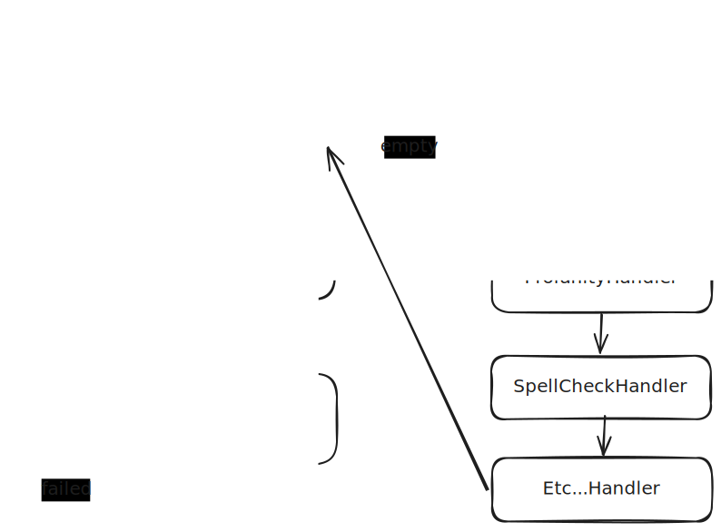

# Chain of Responsibility Pattern

*23-10-2025*

_Status: {Work in progress}/{Idea}_  
_Type of post: {Guide} {Resource}_

## *Rapid fire thoughts*

### When to use Chain of Responsibility Pattern

If you have a flow diagram with a chain.

Document approval chain (by Kevin Dockx) is a good example.

Title filled? -> RecentlyModified? -> ApprovedByLitigation? -> ApprovedByManagement?

In that case you will probably have code like this:

```csharp
if(string.IsNullOrEmpty(document.Title))
{
	return Result.BadRequest("Document must have a title");
}
if(document.LastModified < DateTime.Now.AddMonths(-6))
{
	return Result.BadRequest("Document is outdated");
}
if(!document.IsApprovedByLitigation)
{
	return Result.BadRequest("Document must be approved by litigation");
}
if(!document.IsApprovedByManagement)
{
	return Result.BadRequest("Document must be approved by management");
}
```

At the moment I am working on a project which has a much longer chain of responsibility, resulting in over 20 if-statements in a row. It is driving me crazy.

As I started implementing the chain of responibility pattern, I realized the code branches.

My first try was to have a IHandler interface like this:

```csharp
public interface IHandler<T> where T : class
{
	void Handle(T request);
    
    IHandler<T> SetNext(IHandler<T> handler);
}
```

With a concrete implementation like this:

```csharp
public class TitleHandler : IHandler<Document>
{
	private IHandler<Document> _nextHandler;

	public void Handle(Document document)
	{
		if(string.IsNullOrEmpty(document.Title))
		{
			throw new ValidationException("Document must have a title");
		}
		
		_nextHandler?.Handle(document);
	}

	public IHandler<Document> SetNext(IHandler<Document> handler)
	{
		_nextHandler = handler;
		return handler;
	}
}
```

So when I create a new document, I can create the chain like this:

```csharp
var documentHandlerChain = new TitleHandler();
documentHandlerChain
	.SetNext(new RecentlyModifiedHandler())
	.SetNext(new ApprovedByLitigationHandler())
	.SetNext(new ApprovedByManagementHandler());
	
documentHandlerChain.Handle(newDocument);
```

Nice! 
However, the problem is that the chain branches.

### Solution for branching chains - First idea

I simplified my flow and used depth in my classes to handle this.



So, I have a first chain for document validation, which immediately returns to this handler when the document is empty for example. 
The DocumentHandler accepts a class called DocumentRequest, which has a Document and a Result property. 
Based on the result, the next handler in the chain is called or not.

### Solution for branching chains - Composite pattern

Another way to solve this is to use the Composite pattern. 


## *Outline*

## Resources
[Kevin Docx, C# design patterns, pluralsight ](https://app.pluralsight.com/ilx/video-courses/8b818464-7d56-4f32-a307-04c7049540e1/ed810986-dc27-48ec-b386-efd773bcb6b5/e0a469f0-ed1c-43ac-8ed4-82724f5070bf)  
