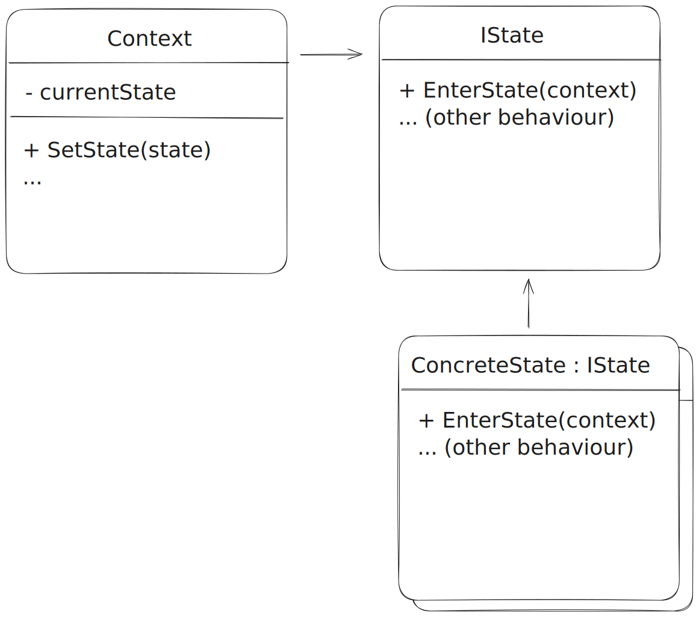
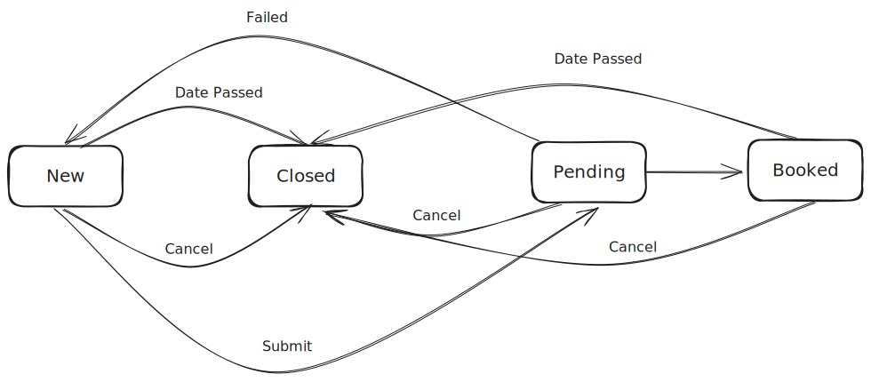
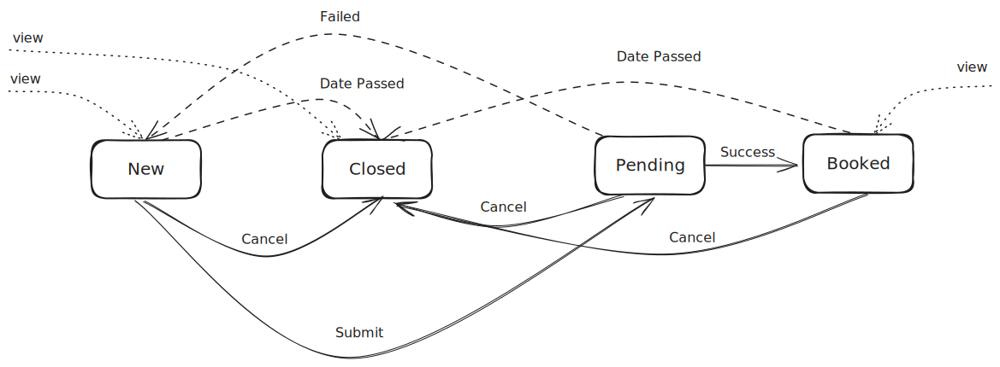
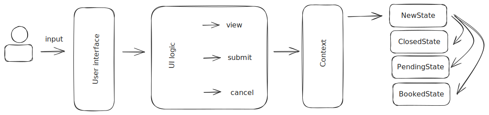

# The state pattern

*22-2-2024*

Status: Work in progress    
Type of post: Resource

## *Rapid fire thoughts*

I want a resource so I can track how to implement

## *Outline*

The state pattern idea  
How to implement the state pattern

# State machine

When to use?
If there is behaviour that differs depending on the state of an object.

If the state is linear, you can use pipe-and-filter (chain of responsibility) pattern.
With linear the process being linear sequence of steps.

Use a state machine when the state is not linear.

## State machine terminology

- State: This is a situation with unique behaviour
- Behaviour: Logic typical for one state
- Transition: The change from one state to another
- Trigger: The event that causes the transition


## The State Pattern

The state pattern consists of three elements: 

- the context
- the state interface
- the state



### The context

The context is the object that holds the concrete current state.

### The state interface

The state interface or abstract state class defines state specific behaviour.

### The state

The state implements behaviours for this specific state context.

It holds all the logic for this concrete specific state.

# How to implement the state pattern

For example, we have this booking application for a music concert.

### Step 1: Find all the states

The booking can have four states:
- New (for new bookings)
- Closed (a closed state for bookings)
- Pending (let's say we have to do some validation)
- Booked (confirmed booking)

### Step 2: Find the behaviour

Let's say the productowner defined the behaviour in the user stories, from that we extract the following:  

The user can interact with our application by:
- The user starts booking a new ticket (new state)
- The user cancels the new booking (new state to closed state)
- The user submits the booking (new state to pending state)
- The user cancels the pending booking (pending state to closed state)
- The user cancels a confirmed booking (booked state to closed state)

Aside from user interaction the application itself can also change the state:
- The application validates the booking:
  - The application fails to validate the booking (pending state to new state)
  - The application successfully validates the booking (pending state to booked state)
- The date of a confirmed booking passes (booked state to closed state)
- The date of a concert passes (new state to closed state)

All these events acting on the booking state are shown in the figure blow, indicating the state transitions.



Personally I like a matrix respresentation better. This matrix represents the events resulting into a state change:

|    | OnCancel  | OnSubmit   | OnFailure | OnSuccess | OnDatePassed |
|---------|-----------|------------|-----------|-----------|--------------|
| New | => Closed | => Pending | -         | -         | => Closed    |
| Closed  | -         | -          | -         | -         | -            |
| Pending | => Closed | -          | => New  | => Booked | -            |
| Booked  | => Closed | -          | -         | -         | => Closed    |

The example is not that complex, but for 4 different states we have only 10 possible outcomes.
For OnCancel the outcome is a transition to closed, or do nothing.
For OnSubmit the outcome is a transition to pending, or do nothing.
Etc.

In the most situation you could have 20 different outcomes for 4 states.

### Step 3: Define the state interface

From step 2 above we have five different events leading to state change:
- Cancelled
- Submitted
- ValidationFailed
- ValidationSucceeded
- DatePassed

And there is always:
- StateEntered

For example, when entering the new state the application might want to check if the date of the concert has passed. If so, it transitions to the closed state.
The user wants to be able to see a booked concert, or the concerts the user visited in the past.

There is a difference between externally triggered events, internally triggered events and the context.



The user may want to view (request) a new booking (new state), or view a booked concert (booked state).
The user can cancel or submit a booking.

The date passed check is an internal event or validation. Pending booking validation might be dependent on an external service, but it is internal logic.

In another way, let me put it like this:



There is an input coming from the user, which can be anything, but let's say it is a mouseclick. At some place the application makes sense of that input, and transforms it into something the application can understand.

This can be a request to a page (view), a cancellation, or a submit. These are the externally triggered events. These events are sent to the Context, which holds the current application state. The current state holds the logic for what to do when this event occurs.

So the externally triggered events are the behaviours of the IState interface (or abstract class if you wish).

- EnterState
- Cancel
- Submit

Example:  
The user requests a new booking, the application starts by entering the new state. The user submits the booking, clicking a submit button. The UI logic transmits the submit to the app, which calls the Submit method in the context, which calls the Submit method of the current (New) state. This state holds the logic for transitioning to pending, and sets the context state to pending, entering the pending state.

Upon entering the pending state, this state does validation. And as a result of that validation, the pending state transitions to Booked or New.


```csharp
public interface IState
{
    void EnterState(BookingContext bookingContext);
    void Cancel(BookingContext bookingContext);
    void Submit(BookingContext bookingContext);
}
```

### Step 4: Define the context

The context holds the current state, and the logic for transitioning to a new state.


```csharp
public class BookingContext
{
    private IState _currentState;

    public void SetState(IState state)
    {
        _currentState = state;
        _currentState.EnterState();
    }
    
    public void RequestPage()
    {
        _currentState.EnterState(this);    
    }
            

    public void Cancel()
    {
        _currentState.Cancel(this);
    }

    public void Submit()
    {
        _currentState.Submit(this);
    }
}
```

In most cases there is an initial state to start in. Or you have a Start or Initialize method, for example to start the state in a NewState IState when entering the page where you can order new tickets, or enter the ClosedState whenever you enter a page with closed bookings.

### Step 5: Implement the states

The states hold the logic for the state specific behaviour.
Implementation is like this:

```csharp
public class NewState : IState
{
    public void EnterState(BookingContext bookingContext)
    {
        // Do something when entering the new state
    }

    public void Cancel(BookingContext bookingContext)
    {
        // Do something when cancelling the new state
        bookingContext.SetState(new ClosedState());
    }

    public void Submit(BookingContext bookingContext)
    {
        // Do something when submitting the new state
        bookingContext.SetState(new PendingState());
    }
}
```

### Step 6: Use the Context anywhere in your application

From any C# code you can use the context to change the state.

```csharp
private BookingContext _bookingContext;

// On initialization of the new booking page:
_bookingContext = new BookingContext();
bookingContext.SetState(new NewState());

// On user interaction with the submit button:
bookingContext.Submit();
```

## Conclusion

These are the steps.
The state pattern creates more layers in the application.
The state pattern takes the big ball of code-mud, and breaks it down into smaller pieces.
It eradicates the need for if-else statements, and makes the code more readable and maintainable.

### Remarks
A working example might give more insight in how to implement the state pattern.

## Resources
