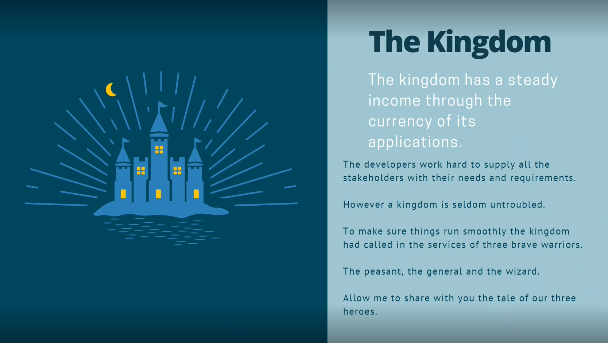
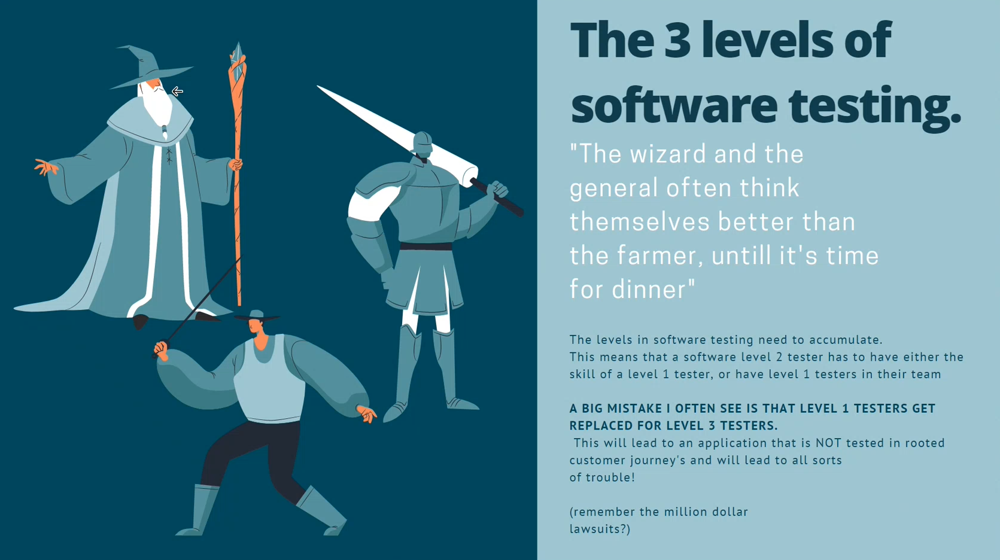
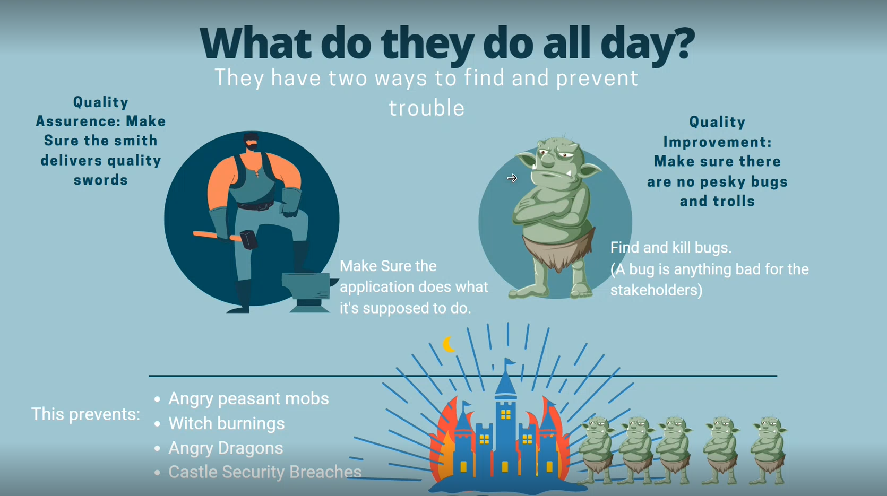
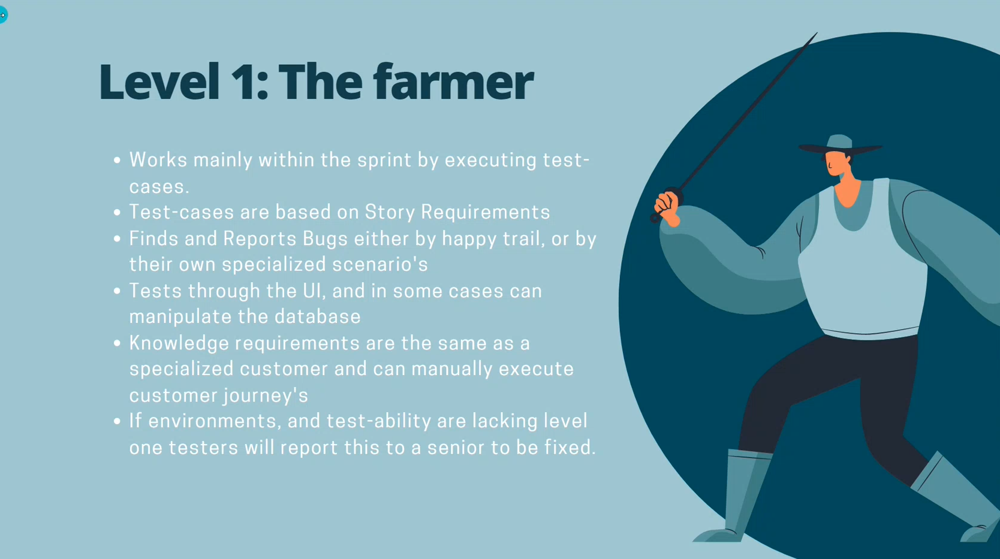
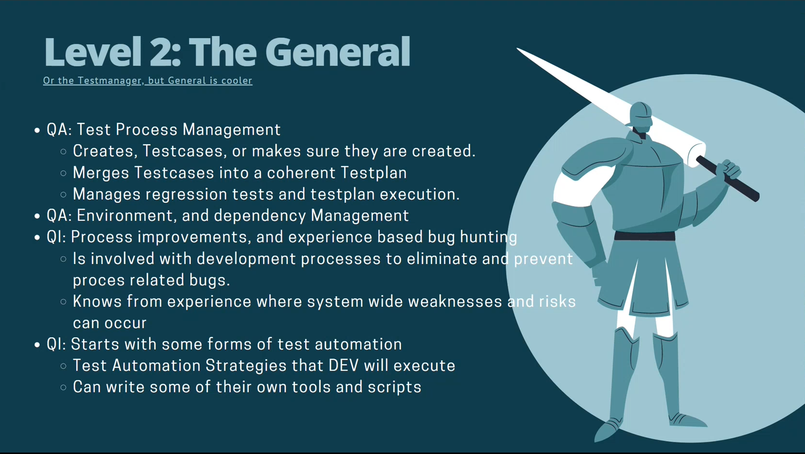
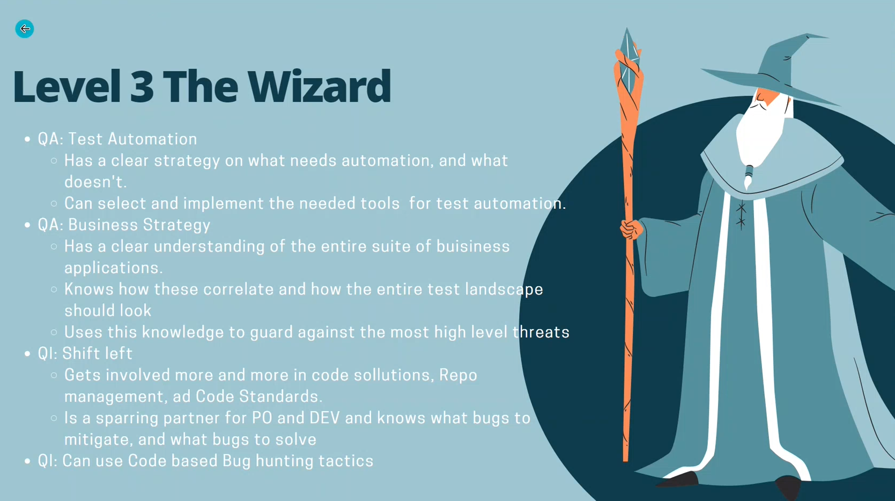

# Testing knowledge base

*4-9-2023*

Status: Work in progress - Not mine!

*By Bas van Laarhoven*

## Intro

> The distinction between [testing and checking](http://www.satisfice.com/blog/archives/856) is about the difference
> between testing itself and one element of it. Checking the output is relatively easy. Evaluating the product to find
> problems — and determining whether people will want to fix those problems or tolerate them — is much more challenging.

~[Rapid Software Testing](https://developsense.com/resources)~

> In testing, we’re trying to shift our notion of the status of the product from untested assumptions to observed facts.

~Michael Bolton~

## About software testing by Bas van Laarhoven

### The kingdom

Tale of the kingdom and our three heroes:

The kingdowm represents the organisation. Developers develop software, and three heroes take care that reliable software
is delivered.

### The heroes

There are three levels of testers:

1. The level 1 tester is represented by the farmer.
2. The level 2 tester is represented by the general
3. The level 3 tester is represented by the wizard

#### Helmer's comments

In organisations level 1 testers are often replaced by a level 3 tester, automated testing rules them all, or "The
wizard and the general often think themselves better than the farmer, untill it's time for dinner". I have witnessed
this happening in a lot of organisations.

As I experienced with Bas at PinkRoccade, and with the team at W/E adviseurs, you cannot do without level 1 testers.
These testers have a "destructive" mindset, and will find bugs or features you never thought about.  
Kees de Jong from W/E was very very good in setting up test scenario's, without touching any bit of software, often even
without anything being designed yet. However, quoting a friend: "When you think something is foolproof, a better fool
will present himself". Or something along those lines.

Having all your software unit tested and automatically tested in pipelines can give you a false sense of security. You
always need the level 1 tester (farmer) to perform emperical tests to see "if the software works".

### The works

The testers prevent bugs, take care of quality assurance. Risk prevention. Manual testing is very important.

### The farmer: level 1 farmer

This where you will find 90% of the bugs. The farmer tests the stories delivered by the developer.

These testers know about customer journeys. Sometimes even more than the business analists or product owners.

### The general: level 2 tester

The general is the "test manager". Not a manager as organisational role, but The general does test the application and
integration, and knows about these dependencies. The general can take care of test automation, writes scripts.

### The wizard: level 3 tester

Wizards are the test leads. They know how to perform magic, the know how to automate the testing, but they do not know
how to grow crops.

Shift-left.

The wizard needs to know what farmers do, what generals do.

### Conclusion

You need a lot of farmers (level 1 testers) for testing. One general per product. And maybe one wizard for the
organisation.

## Comments from Bas AND from discussions between Bas and Helmer

First: Take care your application is tested. Just try to run. Think destructive, what could go wrong, click everywhere.
Look at the console...
Second: Test your stories: Level 1 testing
Third: Only automate tests when the software is stable AND your testers are repeating themselves.

## Resources

[Web app testing 101 - Bas van Laarhoven](https://medium.com/@bas_57051/web-application-testing-101-cf921300011a)  
[How to test Sofware that does not exist yet! - Bas van Laarhoven](https://medium.com/@bas_57051/how-to-test-software-that-doesnt-exist-yet-4be7a5bf3ac3)  
[How to set up an easy agile testing process to keep the bugs away - Bas van Laarhoven](https://medium.com/@bas_57051/how-to-set-up-an-easy-agile-testing-process-to-keep-the-bugs-away-418e1ee7aaa7)  
[Ping first approach - Bas van Laarhoven](https://medium.com/@bas_57051/software-testing-when-there-is-coffee-but-no-cup-ab8a9f9ae6c6)  
[How to set up an easy agile testing process to keep the bugs away - Bas van Laarhoven](https://medium.com/@bas_57051/how-to-set-up-an-easy-agile-testing-process-to-keep-the-bugs-away-418e1ee7aaa7)

[Heuristic Test Strategy Model](https://www.satisfice.com/download/heuristic-test-strategy-model)