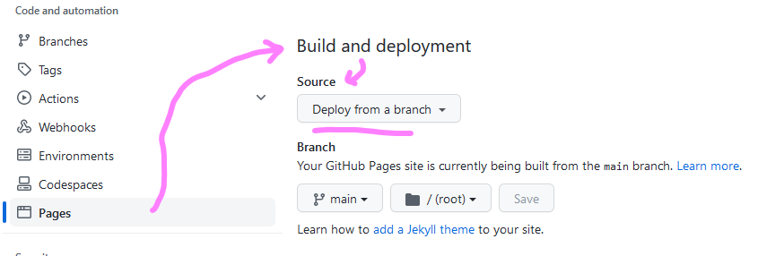

 # Vitepress and GitHub Pages
*27-03-2023*

 I wanted to try out GitHub Pages and VitePress so I just gave it a shot this afternoon. I have to say, starting it is very easy. This is my first page.

## GitHub Pages

 So I started uot with the [quickstart for GitHub Pages](https://docs.github.com/en/pages/quickstart).

It was really easy to setup the repo. I have done that many times before. However I spent a full ten seconds looking for the Under "Build and deployment", under "Source", select Deploy from a branch.
That annoyed me, so for future reference:

I won't forget that!

## Vitepress

Next: [quickstart for GitHub Pages](https://docs.github.com/en/pages/quickstart).

Which was really really easy, since I work with vite on a daily basis, and I have everything installed on my laptop already. The documentation of VitePress is perfect for me, since it looks like the Vue documentation.

All settled, right? No!

First of all, for the first time in my life Visual Studio Code was bugging me not wanting to push to my repo (I think it wanted to say: workday is over Helmer!). This is really weird since I worked on this account with VS Code earlier today. I have Visual Studio for BackEnd development, so as a quick and dirty fix I fired up VS 2022, cloned and pushed without drama.

Nice!

## Gitignore

Wait up! There was no gitignore! I forgot to tell you I added it.
So I ~~stole~~ copied one from [erresen](https://erresen.github.io/vue/js/git/2020/07/08/vue-js-gitigore.html). Thanks! And I added some extra lines because I need to ignore some more.

Thats it, right? Wrong!

## Publishing VitePress to GitHub pages

Because it is not your everyday static website, of course it will not be automatically published and showing up. You need a pipeline. As a senior web dev I know all about pipelines, in Azure DevOps, publishing to Azure. This is a tiny bit different, with the help of the [VitePress deploy documentation](https://vitepress.dev/guide/deploy) I had the pipeline ready in no time.

## Access Control

For Enterprise subscribers, GitHub Pages now has [access control](https://github.blog/changelog/2021-01-21-access-control-for-github-pages/)